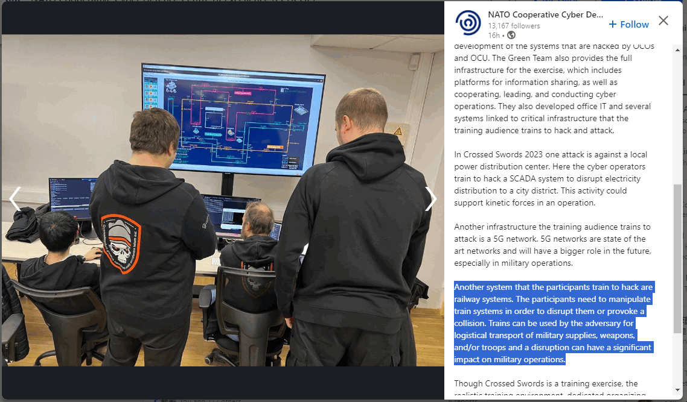
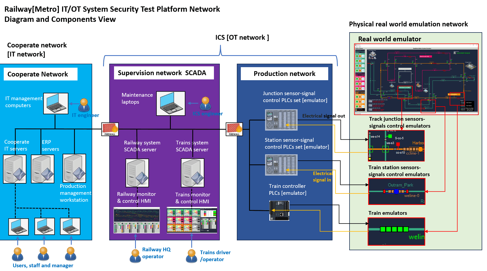
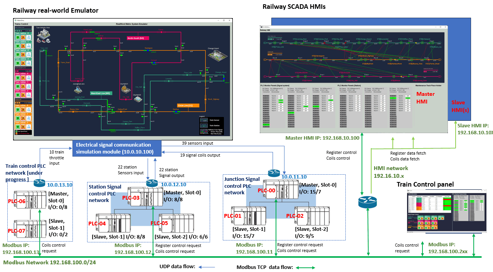
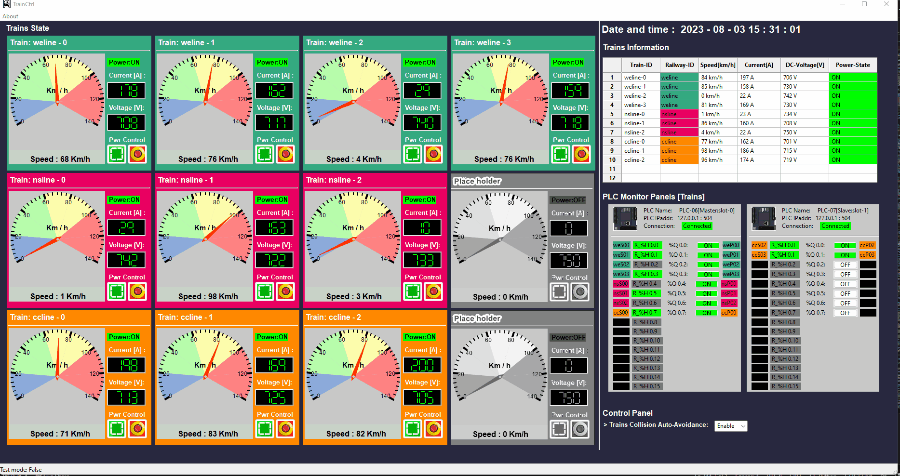
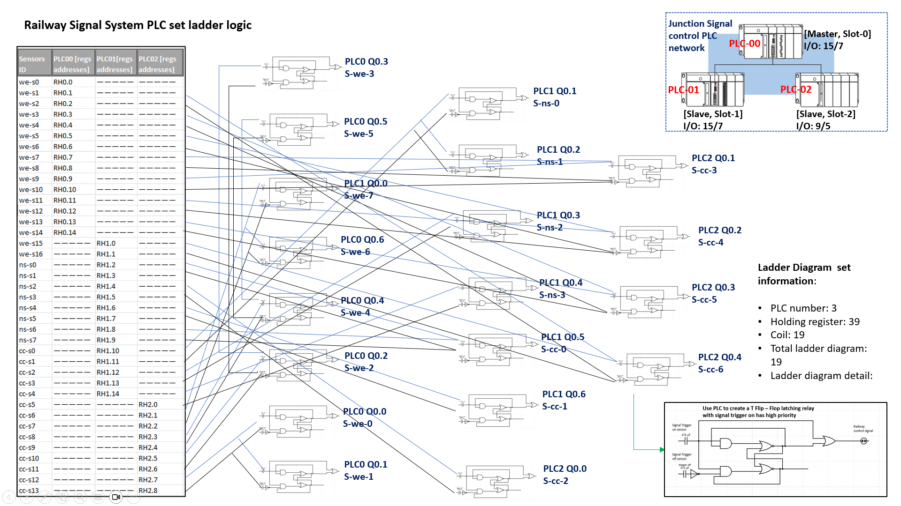
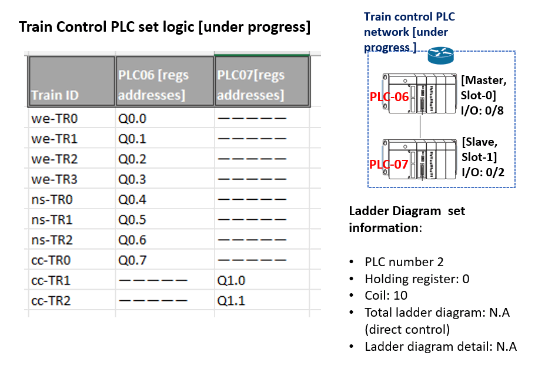
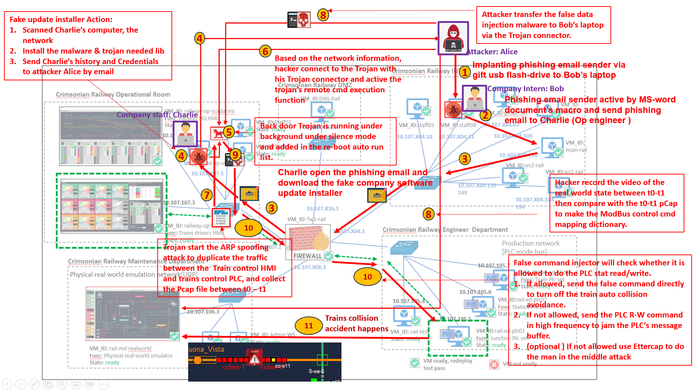

# Railway [Metro] IT/OT System Cyber Security Test Platform ( Mini cyber range)

**Project Design :** We aim to develop a simplified and straightforward digital twin-style emulation platform for a railway system, simulating the operations of multiple trains on various tracks, each with distinct sensor-signal controls. This platform serves as a cyber range for cyber security researchers to showcase and test the impact of various IT attacks on OT systems. The system comprises two sub-projects (cyber range) with eight primary components :

**Railway Company IT-System Cyber Range**

This IT-network cyber range project will simulate the normal corporate network of the railway company, we will use the [Custer User Emulation](https://github.com/LiuYuancheng/Windows_User_Simulator) system to automate simulate different kinds of staff's daily work such as IT-Support-Engineer, Officer Staff, Railway HQ operator, Train driver / safety checker. The main components includes: 

- Railway company corporate network environment (virtual hardware: computer,  node, firewall, router, switches)
- Railway company staff activities auto generator (virtual staff: IT-Support-Engineer, Officer Staff, Railway HQ operator, Train driver / safety checker)

**Railway System OT-System Cyber Range**

The OT Cyber range will enumerate all the railway system's supervision SCADA network, the OT-production network and the physical real-world.  The main components includes: 

- 2D Railway[Metro] System Real-world Emulator
- Railway System SCADA HMI
- Railway System Trains Controller HMI
- Railway Junctions Sensor-Signal System Control PLC Simulator
- Railway Stations Sensor-Signal System Control PLC Simulator
- Railway Trains Sensor-Power System Control PLC Simulator

##### Project Use Case

We are glad to share that the Railway [Metro] IT/OT Emulation System Cyber Security Test Platform we developed this year was used for building one part of the cyber-attack target training system in the NATO CCDCOE Cross Sword 2023 offensive cyber exercise. CCDCOE LinkedIn POST: [ > link](https://www.linkedin.com/posts/natoccdcoe_crossedswords-activity-7140986334961217536-7dM5/?utm_source=share&utm_medium=member_desktop)

[TOC]

**Table of Contents**

- [Railway[Metro] IT/OT System Cyber Security Test Platform ( mini cyber range)](#railway-metro--it-ot-system-cyber-security-test-platform---mini-cyber-range-)
        * [Project Use Case](#project-use-case)
    + [Introduction](#introduction)
    + [Detailed Sub-System Design](#detailed-sub-system-design)
      - [1. 2D Railway[Metro] System Real-world Emulator](#1-2d-railway-metro--system-real-world-emulator)
      - [2. Railway System SCADA HMI](#2-railway-system-scada-hmi)
      - [3. Railway System Trains Controller HMI](#3-railway-system-trains-controller-hmi)
      - [4. Railway Junctions Sensor-Signal System Control PLC Simulator](#4-railway-junctions-sensor-signal-system-control-plc-simulator)
      - [5. Railway Stations Sensor-Signal System Control PLC Simulator](#5-railway-stations-sensor-signal-system-control-plc-simulator)
      - [6. Railway Trains Sensor-Power System Control PLC Simulator](#6-railway-trains-sensor-power-system-control-plc-simulator)
    + [System Network Design](#system-network-design)
      - [Main cyber range network design](#main-cyber-range-network-design)
      - [OT cyber range network design](#ot-cyber-range-network-design)
    + [Cyber Attack Demonstration Case Study](#cyber-attack-demonstration-case-study)
      - [IT system cyber attack case study](#it-system-cyber-attack-case-study)
        * [IT system cyber attack case 1: Phishing and backdoor trojan](#it-system-cyber-attack-case-1--phishing-and-backdoor-trojan)
      - [OT system cyber attack case study](#ot-system-cyber-attack-case-study)
        * [OT Cyber Attack Demo on PLC [Case Study 01] : False Data / Cmd Injection Attack Case](#ot-cyber-attack-demo-on-plc--case-study-01----false-data---cmd-injection-attack-case)
        * [OT Cyber Attack Demo on HMI  [Case Study 02] : ARP Spoofing Attack Case](#ot-cyber-attack-demo-on-hmi---case-study-02----arp-spoofing-attack-case)
        * [OT Cyber Attack Demo on PLC [ Case Study 03 ] : DDoS Attack Case](#ot-cyber-attack-demo-on-plc---case-study-03-----ddos-attack-case)
        * [OT Cyber Attack Demo on HMI-PLC control Chain [ Case Study 04 ] : Man in the middle Attack Case](#ot-cyber-attack-demo-on-hmi-plc-control-chain---case-study-04-----man-in-the-middle-attack-case)
      - [Problem and Solution](#problem-and-solution)

------

### Introduction 

The Railway[Metro] IT/OT System Security Test Platform serves as a miniature railway IT/OT network emulation system, designed to empower ICS researchers in testing their IT/OT attack and defense solutions on our cyber range. Additionally, it also provides different IT/OT cyber attack cases for the ICS security training and education purposes. The entire system is composed of four main network components, as illustrated in the diagram below:

1. **Corporate network**: This subnet replicates a typical railway company's corporate IT network, encompassing various functional servers (email, DMZ, staff management) and a production management workstation. This workstation hosts essential components such as the production log archiving database, internal document server, and operator manuals.
2. **Supervision SCADA network**: Simulating the SCADA system network, this subnet features distinct SCADA data/historian servers, multiple HMI computers for system operators, and maintenance computers dedicated to ICS/OT-system engineers.
3. **Production network**: This subnet host all PLC simulator programs, contributing to a realistic representation of the production environment within the railway system.
4. **Physical real-world emulation network**: In this subnet, railway real-world components are emulated to demonstrate the tangible effects of actual items in the real working environment.

**Railway Company OT-System Cyber Range Introduction**

The OT-System Cyber Range is designed to replicate the tangible, physical hardware aspects of a railway system. It will emulate the railway control center featuring a supervisory SCADA network, the Sensor Signal PLC network governing railway and train control in the production environment and emulate the physical wire connections that constitute the real-world infrastructure

Included components: 

- One real world emulator
- One HQ HMI (master mode) 
- N train dispatcher HMI (slave mode )
- 2 train control PLC
- 3 Junction signal control PLC
- 3 Station control PLC
- One train operator HMI (master mode)
- N train driver HMI
- N train safety checker HMI

**Railway Company IT-System Cyber Range** **Introduction**

Railway[Metro] **IT** System security mini cyber range is constructed by 5 main sub-network (introduced in the program design) under below structure. Within the IT System Cyber Range, our goal is to meticulously simulate not only the hardware infrastructure of the Company's network but also replicate the daily human activities of Railway Company staff. This approach aims to create an immersive and realistic environment closely resembling the operations of a genuine railway company.

Six kinds of different railway company staff human activity emulator: 

- IT-Support-Engineer
- Railway Officer, 
- Railway HQ operator, 
- Train driver / Operator 
- Railway safety checker
- Railway maintenance engineer

`Version v0.3.1`

------

### Detailed Sub-System Design

The detail introduction of each component is shown below: 

#### 1. 2D Railway[Metro] System Real-world Emulator

Our objective is to develop a Railway system emulator that accurately simulates real-world scenarios, including trains navigating tracks, responding to signal systems, docking at stations, and being controlled by train drivers. The system encompasses four tracks, ten trains, a track junction signal control system, a station control system, and a train driver controller. Additionally, the emulator facilitates connectivity to three sets of PLC modules through a dedicated PLC interface. This comprehensive design aims to provide a realistic and dynamic railway simulation environment. 2D Railway[Metro] System real-world emulator UI: 

2D Railway[Metro] System real-world emulator UI detailed software design document: [ > link](doc/metroEmuUI_readme.md)

#### 2. Railway System SCADA HMI

Our aim is to develop a Railway SCADA (Supervisory Control and Data Acquisition) program integrated with a Human Machine Interface (HMI) to facilitate the comprehensive monitoring and control of multiple railway junctions and stations. The envisioned functionalities include:

- Offering a PLC (Modbus TCP) connection interface for fetching and setting the PLCs' register and coil states.
- Visualizing the current state of connected PLCs, including holding register states, coil states, and digital I/O states.
- Providing a visual representation of the state of tracks, including sensor and signal states, along with an overview of the sensor-signal auto-controlling process.
- Displaying the state of tracks and train-station sensors and signals, along with insights into the auto-controlling processes.
- Implementing an overload control mechanism for sensor and signal states, accessible with appropriate administrative engineer debug permissions.

Railway System SCADA HMI UI :

Railway System SCADA HMI detailed software design document: [> link](doc/scadaHMI_readme.md)

#### 3. Railway System Trains Controller HMI

Our goal is to develop a Trains Controller Human Machine Interface (HMI) that offers comprehensive information visualization and control capabilities for multiple trains. The key functions include:

- Implementing a PLC (Modbus TCP) connection interface to facilitate the fetching and setting of PLC register and coil states.
- Visualizing the current states of connected PLCs, including holding registers and coils.
- Extracting data from trains control PLC sets to simulate a 750V-DC power trains system. This system will then display pertinent trains information such as speed, current, and voltage to the user.
- Incorporating a Trains Power Control Panel, allowing users to effortlessly toggle the power states of individual trains.

This design ensures an efficient and user-friendly interface for monitoring and controlling multiple trains, offering real-time insights into their vital parameters and enabling seamless power management. 

Railway System Trains Controller HMI UI:

Railway System Trains Controller HMI detailed software design document: [> link](doc/trainsCtrlHMI.md)

#### 4. Railway Junctions Sensor-Signal System Control PLC Simulator

**Project Design :** we want to create a Programmable Logic Controllers(PLC) set with 3 PLCs to below tasks:

1. Read the 39 train sensors (connect to PLCs' input) state from the real-word emulator to PLCs' holding register state.
2. Run the pre-set ladder logic (flip-flop latching relay) to change the 19 real-world signals (connect to PLCs' output coils) state. 
3. Create a Modbus server to handle the HMI's Modbus TCP request to update/change register/coils value. 

This simulator will simulate 3 standard Siemens S71200 PLCs (16 input + 8 output / total 48 input + 24 output) PLCs connected under master and salve mode.  The PLCs set Electrical I/O connection and the Ladder logic is shown below. 

Railway Junctions Sensor-Signal System Control PLC Simulator detailed software design document: [ > link](doc/sensorsPLCSimu_readme.md)

#### 5. Railway Stations Sensor-Signal System Control PLC Simulator

**Project Design :** we want to create a Programmable Logic Controllers(PLC) set with 3 PLCs to below tasks:

1. Read the 22 train stations' train dock sensors  (connect to PLCs' input) from the real-word emulator to PLCs' holding register state.
2. Run the pre-set ladder logic (direct trigger latching relay) to change the 44 real-world station enter/exit signals (connect to PLCs' output coils) state. 
3. Create a Modbus server to handle the HMI's Modbus TCP request to update/change register/coils value. 

This simulator will simulate 3 standard Siemens S71200 PLCs (16 input + 8 output / total 48 input + 24 output) PLCs connected under master and salve mode. The PLCs set Electrical  I/O connection and the Ladder logic:

Railway Stations Sensor-Signal System Control PLC Simulator detailed software design document: [> link](doc/stationPLCSimu_readme.md)

#### 6. Railway Trains Sensor-Power System Control PLC Simulator

**Project Design :** we want to create a Programmable Logic Controllers(PLC) set with 2 PLCs to below tasks:

1. Read the 10 trains speed sensors  (connect to PLCs' input) from the real-word emulator to PLCs' holding register state.

2. Use 10 PLC output coils to control the trains power.
3. Create a Modbus server to handle the HMI's Modbus TCP request to update/change register/coils value. 

This simulator will simulate 2 standard Siemens S71200 PLCs (16 input + 8 output / total 32 input + 16 output) PLCs connected under master and salve mode. The PLCs set Electrical I/O connection and the Ladder logic:

Railway Trains Sensor-Power System Control PLC Simulator detailed software design document: [link](doc/trainsPlcSimu_readme.md)

**Program version:** `v0.3.2`

Code base: https://github.com/LiuYuancheng/Metro_emulator/tree/main/src

------

### System Network Design 

#### Main cyber range network design

#### OT cyber range network design

------

### Cyber Attack Demonstration Case Study

Currently we use our mini cyber range provide one IT cyber attack case study and four different OT cyber attack case study. 

#### IT system cyber attack case study

##### IT system cyber attack case 1: Phishing and backdoor trojan 

Detailed case study document [> link](https://github.com/LiuYuancheng/Cross-Sword-2023-Nato-Event/blob/main/attackDemos/falseDataInjection/instructorManual_FDJ.md)

#### OT system cyber attack case study

##### OT Cyber Attack Demo on PLC [Case Study 01] : False Data / Cmd Injection Attack Case

Detailed case study document [> link](attack/OT_attack_case1_falseCmdInjection.md)

##### OT Cyber Attack Demo on HMI  [Case Study 02] : ARP Spoofing Attack Case

Detailed case study document [> link](attack/OT_attack_case2_arpSpoofingAttack.md)

##### OT Cyber Attack Demo on PLC [ Case Study 03 ] : DDoS Attack Case

Detailed case study document [> link](attack/OT_attack_case3_ddosModbusAttack.md)

##### OT Cyber Attack Demo on HMI-PLC control Chain [ Case Study 04 ] : Man in the middle Attack Case

Detailed case study document [> link](attack/OT_attack_case4_MitmAttack.md)

------

#### Problem and Solution

Refer to `doc/ProblemAndSolution.md`

------

> last edit by LiuYuancheng (liu_yuan_cheng@hotmail.com) by 30/05/2023 if you have any problem, please send me a message. 