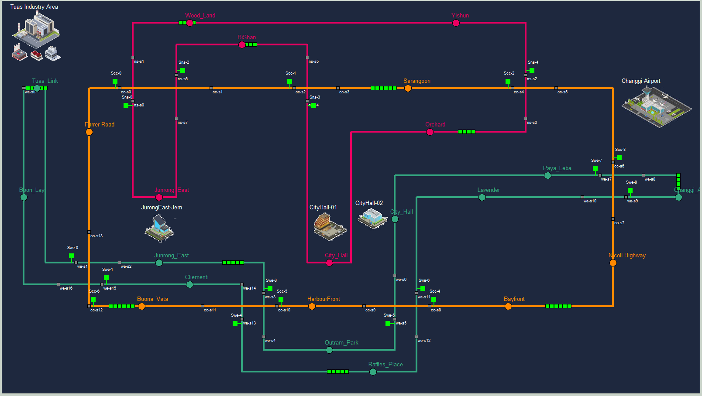
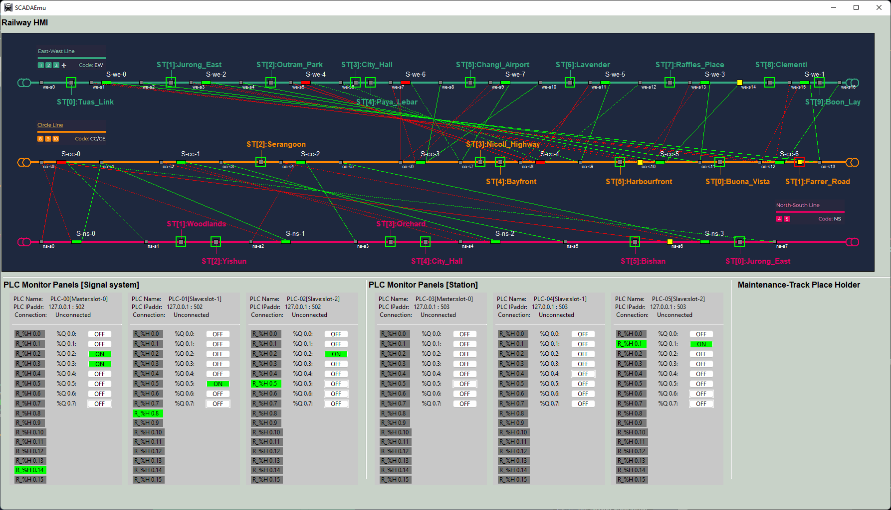
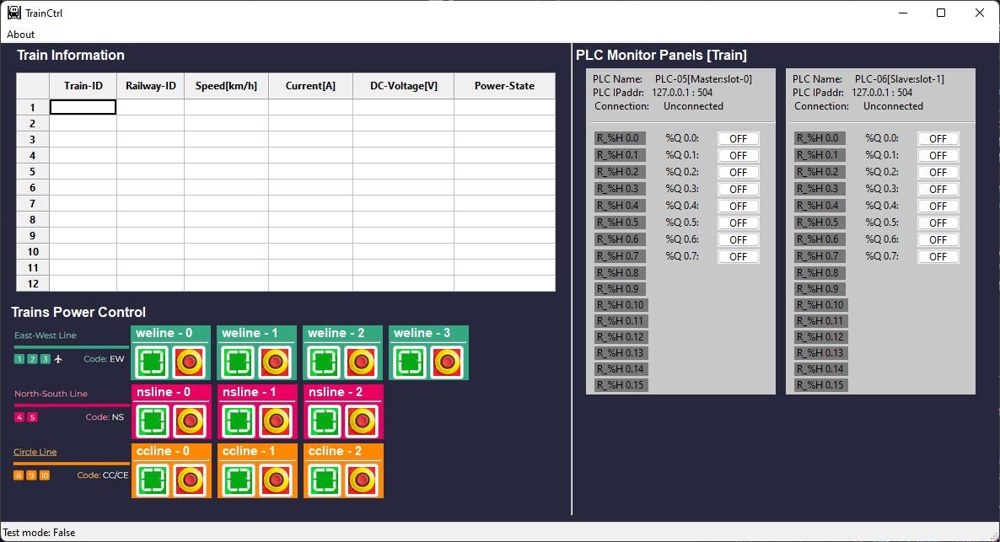
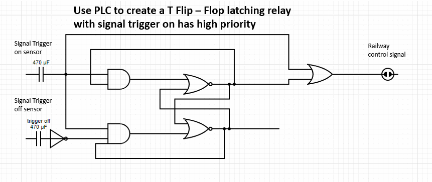

# Metro_Railway_System_Emulator

**Project Design :** We want to create a digital twin type Metro  emulation system to simulate multiple trains running on different tracks with the control signals. The system contents 3 parts: 

- Metro railway signal system real word emulator (2D).

- HMI and SCADA system for railway and train control. 
- PLC and latching relay emulators.

2D metro emulator UI: 

SCADA-HMI UI

Train Power Controller UI

------

### System Design 

The 3 parts will follow below work flow: 

#### System network design

#### System data communication network design

Signal system PLC ladder diagrams set

Station system PLC ladder diagram set: 

Train control PLC config: 

For each sensors-Signal set, the circuit logic is below:

Verify circuit logic: https://www.circuit-diagram.org/editor/

------

> last edit by LiuYuancheng (liu_yuan_cheng@hotmail.com) by 30/05/2023 if you have any problem, please send me a message. 