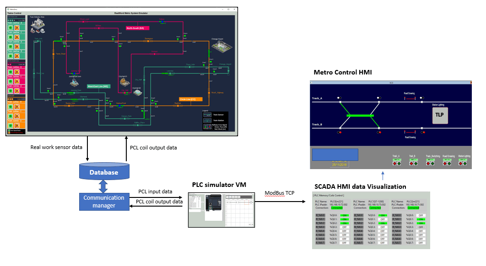

# Metro_emulator

[under Editing]

**Project Design :** We want to create a digital twin type Metro emulation system to simulate multiple trains running on different tracks with the control signals. The system contents 3 part: 

- Metro system real word emulator (2D).

- HMI and SCADA system. 
- PLC and latching relay emulator.

2D metro emulator UI: 

### System Design 

The 3 parts will follow below work flow: 

------

> last edit by LiuYuancheng (liu_yuan_cheng@hotmail.com) by 30/05/2023 if you have any problem, please send me a message. 