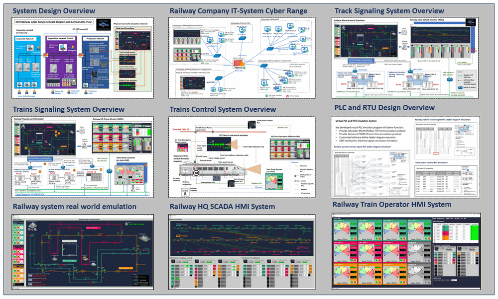

# Mini Railway Cyber Range 

### Railway [Metro] IT-OT System Cyber Security Test Platform


**Project Design Purpose :** Our objective is to develop a miniature cyber range capable of simulating the IT-OT environment of a railway company/system. This platform serves multiple purposes including cyber exercises, professional training, IT-OT security project research, development and testing. It will provide a simplified and straightforward digital-twin style Operational Technology (OT) environments emulation platform for the railway signaling systems. This platform will simulate the operations of multiple trains on various tracks, each equipped with distinct sensor-signal controls. Additionally, it will emulate a normal corporate network with various user activities to simulate the Information Technology (IT) environment. The program will offer several different modules to simulate Level 0 (Physical Process Field I/O device) to Level 5 (Internet DMZ Zone) of an IT-OT environment, as illustrated below:


`Figure-01: Mini_railway_cyber_range_IT-OT_layer_diagram, version v0.1.4 (2024)`

This platform serves as a cyber range for conducting cyber security exercises to demonstrate and assess the impact of various IT attacks on OT systems. The system comprises four primary components: 

1. 2D Railway [Metro] System Physical-world Emulator. 
2.  Railway OT-Field-Controller Simulation (PLC & RTU) Programs.
3. Railway SCADA System Simulator. 
4. Railway Company's Corporate Environment Simulation. 

```
# version:     v0.1.4
# Created:     2023/05/21
# Copyright:   Copyright (c) 2023 LiuYuancheng
# License:     MIT License
```

**Table of Contents**

[TOC]

------

### Introduction

The Mini Railway Cyber Range ( Railway [Metro] IT-OT System Cyber Security Test Platform ) serves as a miniature railway IT/OT network emulation system designed to empower ICS researchers in testing their IT/OT attack and defense solutions on our cyber range. Additionally, it also provides different IT and OT cyber attack cases for the ICS security training and education purposes. The entire system is composed of below contents: 

- **Two sub cyber ranges**: Railway Company IT-System Cyber Range and Railway System OT-System Cyber Range
- **Four main network components**:  Corporate network, Supervision SCADA network, Production network and Physical real-world emulation network. 
- **Nine program modules**: 2D Railway [Metro] System Real-world Emulator, Railway System SCADA HMI, Railway System Trains Controller HMI, Railway junction and station Sensor-Signal System Control PLC Simulators, Train control PLC simulators, Train monitoring RTU simulators, Railway company staff activities auto generator and cyber attack scenario simulation program.



`version v0.1.4 (2024)`

#### Introduction of railway company IT-system cyber range

The IT-network sub cyber range project will simulate the normal corporate network of the railway company ( lvl4~lvl5 in an IT-OT environment) , we will use the [Custer User Emulation System](https://github.com/LiuYuancheng/Windows_User_Simulator)  to automate simulate different kinds staff (blue team)'s daily work such as IT-Support-Engineer, Officer Staff, Railway HQ operator, Train driver / Train safety checker. It also provide the malicious activities (red teaming) generation program for simulate the attack scenario. The project consists of three primary components as shown below:

| Components Name                         | Components Description                                       | Reference links                                              |
| --------------------------------------- | ------------------------------------------------------------ | ------------------------------------------------------------ |
| Corporate network environment           | A network with physical hardware / virtual machine (such as computer,  node, firewall, router, switches ... ) to simulate the railway company's IT-network. | [> Detail Example Link](https://github.com/LiuYuancheng/Cross-Sword-2023-Nato-Event/tree/main/ansibleVM) |
| Company staff activities auto generator | A cluster user (blue team) activities generation system to simulate virtual staff (such as IT-Support-Engineer, Officer Staff, Railway HQ operator, Train driver / safety checker...) daily work activities and network traffic. | [> Detail Example Link ](https://github.com/LiuYuancheng/Lockshield_202X_NCL/tree/main/LS2024/deployment) |
| Attack simulation system                | An attacker (red team) malicious activates generation system which can simulate hacker's attacking action such as phishing email, FDI, FCI, MITM, DDoS... | [> Detail Example Link](https://github.com/LiuYuancheng/Lockshield_202X_NCL/tree/main/LS2024/src/Hackers) |

#### Introduction of railway system OT-system cyber range

The OT-environment cyber range will simulate the railway track signaling system and the train control system (lvl0 ~ lvl3 in an IT-OT environment) includes the the real-world physical device action, the OT-production network with the OT field device and the  railway system's supervision SCADA network. 

| Components Name                             | Level   | Components Description                                       | Document link                                      |
| ------------------------------------------- | ------- | ------------------------------------------------------------ | -------------------------------------------------- |
| 2D Physical Real-world Simulator            | Lvl-0   | A physical world components/device (track, train, signal sensor, city) simulation program with a 2D UI for user to view the real-world situation. | [> Detailed Program Doc](src/metroEmuUI/readme.md) |
| Track Junctions Sensor-Signal PLC Simulator | Lvl-1   | A emulation program to simulate the function of multiple PLC devices in the track junction sensor-signal control part in the railway signaling system. |                                                    |
| Stations Sensor-Signal PLC Simulator        | Lvl-1   | A emulation program to simulate the function of multiple PLC devices in the station train dock guiding sensor-signal control part in the station signaling system. |                                                    |
| Train Sensor-Power PLC Simulator            | Lvl-1   | A emulation program to simulate the function of PLC device on Train to control the train's power and the motion. |                                                    |
| Train Sensor RTU Simulator                  | Lvl-1   | A emulation program to simulate the function of RTU device on Train to read trains' sensor data and send back to the SCADA-HMI system |                                                    |
| Trains Controller HMI                       | Lvl-2   | HMI to connect to the train control PLC and RTU to monitor train state and control the trains operation. | [> Detailed Program Doc](src/scadaEmuUI/readme.md) |
| Railway Controller HMI                      | Lvl-2/3 | SCADA HMI in railway track management HQ to monitor and control the railway track operation. |                                                    |

#### Introduction of the cyber range networks

The cyber range provide four different network to simulate the IT-OT environment from level0 to level5, the overview of the network is shown below:


`version v0.1.4 (2024)`

1. **Corporate network**: This subnet replicates a typical railway company's corporate IT system network, encompassing various functional servers (wen, email, DMZ, staff management...) and a production management workstation. This workstation hosts essential components such as the production log archiving database, internal document server, and operator manuals. It will simulate the `Level 5 Internet DMZ Zone` and `Level 4 Enterprise Zone`  of the IT-OT environment.
2. **Supervision SCADA network**: A subnet simulating the OT environment SCADA system network, this subnet features distinct SCADA data/historian servers, multiple HMI computers for system operators, and maintenance computers dedicated to ICS/OT-system engineers. It will simulate the `Level 3 Operations Management Zone`  and  `Level 2 Control Center (HQ) Processing LAN` of the OT environment.
3. **Production network**: This subnet host all ICS field device PLC & RTU simulator programs, contributing to a realistic representation of the production environment within the railway system. It will simulate the `Level 1 Controller LAN` of the OT environment.  
4. **Physical real-world emulation network**: In this subnet, railway real-world components are emulated to demonstrate the tangible effects of actual physical items / device (sensors, moto, switch ...) in the real working environment, all the device simulation program will running in this subnet to generate the "virtual" electrical signal and feed the signal in the PLC and RTU in the production network. This network will simulate the `Level 0 Physical Process Field I/O devices` of the OT environment. 


------

### Project Use Case

**Cross Sword 2023**

We are glad to share that the Railway [Metro] IT/OT Emulation System Cyber Security Test Platform we developed this year was used for building one part of the cyber-attack target training system in the NATO CCDCOE Cross Sword 2023 offensive cyber exercise. CCDCOE LinkedIn POST: [ > link](https://www.linkedin.com/posts/natoccdcoe_crossedswords-activity-7140986334961217536-7dM5/?utm_source=share&utm_medium=member_desktop)


`version v0.1.4 (2024)`

**OT Cyber exercise workshop case studies**

Currently we use our the cyber range provide different demo and hands-on training  case study  for IT-OT cyber attack workshop.


------

### Operational Technology (OT) System Design 

In this section we will introduce the general design of each sub OT system includes the track signaling system, the train control system, OT-field device(PLC & RTU) design. For the detail design, please refer to the sub-system document in the doc folder. 


#### Design of the Railway Track OT Signaling System 

The Track Signaling Simulation System forms the track control part of the railway system OT network, leveraging PLCs to control track junctions and railway stations. The PLC simulators continuously gather simulated electrical signals from a Physical-real-world simulation program (Such as trains' position detection sensor state and track control signals state). These data are utilized to automate control over track, junction, and station signals, achieving the following objectives:

1. Simulating the railway fixed block signaling control mechanism in the track-train management .
2. Managing train passage through different tracks junction areas to ensure safety operation.
3. Guiding trains to dock and depart from the railway stations.

The system comprises two sets of PLCs, totaling 6 PLCs each, which autonomously retrieve sensor data and adjust signals based on pre-configured ladder logic. Additionally, it offers a level 2 HMI for railway HQ operators to monitor and manage track operations, alongside multiple level 3 HMI for the maintenance engineers and operational safety personnel to oversee the signaling system. The system diagram below illustrates its components and structure:


Key components of the system (as marked with idx number in the system diagram) : 

| Idx  | Key Components                            | Component Function Description                               | IT-OT level |
| ---- | ----------------------------------------- | ------------------------------------------------------------ | ----------- |
| 1    | One electrical signal simulation subnet   | Facilitating virtual electrical communication between the physical device simulation program and the OT-Field devices ( PLC). | lvl-0       |
| 2    | 22 station train detection sensors        | Detect the train location inside and outside the station.    | lvl-0       |
| 3    | 22 station train control signals          | Guide trains docking and departure the railway station.      | lvl-01      |
| 4    | 1 Station PLC subnet with 3 PLCs          | Three master-slave configured PLC simulators with pre-set ladder logic for automatic track train sensor reading and station signal adjustment. | lvl-1       |
| 5    | 39 track train detection sensors          | Detect the trains position which is used for the fixed block signaling control mechanism. | lvl-0       |
| 6    | 19 junction train controls signals        | Manage the track junction pass or block based on the trains trains sensors state. | lvl-0       |
| 7    | 1 Junction PLC subnet with 3  PLCs        | Three master-slave configured PLC simulators with pre-set ladder logic for automatic track train sensor reading and junction signal adjustment. | lvl-1       |
| 8    | 1 Modbus subnetwork featuring a SCADA HMI | One master HMI for railway HQ operator to monitor fixed signaling system state in real time, junction control sensor-signal state, station sensor-signal control state and do necessary override control of all the PLCs. | lvl-2       |
| 9    | 1 HMI link subnetwork                     | One HMI link subnetwork with multiple slave management HMI to enabling other railway staff to get a general overview of the junction and station statuses. | lvl-2/3     |


#### Design of the Railway Train OT Signaling System 

The Train Signaling Simulation System forms the trains control part of the railway system OT network, utilizing PLCs and RTUs for efficient trains management. PLCs are responsible for controlling the 3rd track power supply, signaling to trains, and implementing auto collision avoidance mechanisms. RTUs will automatically gather operational sensor data from trains, such as throttle/break percentage, input voltage, motor current, and speed. Together, the PLCs and RTUs facilitate following objectives:

1. Automated detection of track signal states to control train passage through junctions and station docking/departure.
2. Collision avoidance by monitoring the front train and fixed blocking states of railway tracks.
3. Data transmission to railway HQ and train driver consoles for monitoring and control purposes.

The system comprises two sets of PLCs and one set of RTUs. One PLC set (with 2 PLCs) controls the 3rd track power, while another set (also with 2 PLCs) manages critical train controls like throttle, brake, and power. The RTU set consists of 10 units to monitor train information. Additionally, two types of HMIs are integrated into the system:

- **On-train driver console**: the train local HMI will connect to on-train PLCs and RTUs then allow train drivers to monitor automated operations and control trains,
- **Railway HQ train HMI**: the HQ remote HMI will  connect  the 3rd track control PLCs and on-train RTUs via wireless connection. then enable monitoring of general train operations and control of the 3rd track power. 

The system diagram below illustrates its components and structure:


Key components of the system (as marked with idx number in the system diagram) : 

| Idx  | Key Components                        | Component Function Description                               | IT-OT level |
| ---- | ------------------------------------- | ------------------------------------------------------------ | ----------- |
| 0    | Electrical signal simulation subnet   | Facilitating virtual electrical communication between the physical device simulation program and the OT-Field devices ( PLC). | lvl-0       |
| 1    | 10 third-track power control switches | Virtual switches in the physical real-world simulator control the power supply from the railway system's 3rd track power to trains. | lvl-0       |
| 2    | One 3rd-track PLC subnet with 2 PLCs  | Two master-slave configured PLC simulators control track power supply and accept commands from railway HQ train HMIs via Modbus. | lvl-1       |
| 3    | 10 train front sensors                | Train front sensor to detect the track signal state and front trans distance. | lvl-0       |
| 4    | 20 train control switches             | Virtual switches in 10 train simulators control basic train operations and accept Modbus commands from train driver consoles. | lvl-0       |
| 5    | 50 train data sensors                 | Virtual sensors in 10 train simulators generate train data such as throttle/break percentage, input voltage, motor current, and speed. | lvl-0       |
| 6    | One on train PLC subnet with 2 PLCs   | Two master-slave configured PLC simulators simulate on-train Modbus to control train operations based on track signaling and accept commands from train driver consoles. | lvl-1       |
| 7    | One on train RTU subnet with 10 RTUs  | A subnet with 10 RTU simulators collects data from ten trains' 50 sensors. | lvl-1       |
| 8    | 10 Train driver consoles              | Train driver console enable train drivers to monitor automated operations and control trains, connecting to on-train PLCs and RTUs. | lvl-2       |
| 9    | 1 railway HQ train HMI                | Monitors general train operations and controls 3rd track power, connecting to 3rd track control PLCs and on-train RTUs via wireless connection. | lvl-2       |


####  Design of Train PLC and RTU Control

In the train control system, we employ one PLC simulator to manage the third railway track's power supply, along with a Train RTU tasked with reading sensor data onboard the train. Additionally, we utilize another on-board Train PLC to read essential functions such as motor throttle, braking, front collision radar, and the auto-collision avoidance mechanism. The system workflow is depicted below:


The railway dispatches power control PLC sends signals to the Human-Machine Interface (HMI) via Modbus-TCP, while the on-board RTU transmits train data to the HMI using S7Comm through a wireless connection. All the on train PLC and RTU will also be controlled by the train driver console.


------

### User Interface Overview 

The system provides three main graphic user interfaces for the user, cyber exercise participants and management team to monitor and control the system. 

#### 2D Railway[Metro] System Real-world Emulator

The 2D Railway[Metro] System Real-world Emulator GUI serves as a tool for visualizing physical real-world scenarios through simple animations, such as trains traversing tracks and docking at stations. This emulator program depicts a railway system within a cityscape, featuring four tracks, ten trains, track junction signal control systems, and railway station control systems. This comprehensive design aims to deliver a realistic and dynamic railway simulation environment. Below is an overview of the GUI:


>  **Reference**:  2D Railway[Metro] System real-world emulator UI detailed software design document [ > link](doc/metroEmuUI_readme.md)


### Information Technology (IT) System Design

This IT-network cyber range project will simulate the normal corporate network of the railway company with several different function servers and different life staff and users.  Within the IT System Cyber Range, our goal is to meticulously simulate not only the hardware infrastructure of the Company's network but also replicate the daily human activities of Railway Company staff.


, we will use the [Custer User Emulation] system to automate simulate different kinds of staff's daily work such as IT-Support-Engineer, Officer Staff, Railway HQ operator, Train driver / safety checker. The main components includes: 

- Railway company corporate network environment (virtualize the railway company infrastructure: network, computer, node, firewall, router, switches), the company email server, web server document server and normal staff's laptops...
- Railway company staff activities auto generator (virtual the railway company staff: IT-Support-Engineer, Officer Staff, Railway HQ operator, Train driver / safety checker, maintenance engineer)


The IT system simulate a normal company's corporate network with several different function servers  


**Railway Company IT-System Cyber Range** **Introduction**

Railway[Metro] **IT** System security mini cyber range is constructed by 5 main sub-network (introduced in the program design) under below structure. Within the IT System Cyber Range, our goal is to meticulously simulate not only the hardware infrastructure of the Company's network but also replicate the daily human activities of Railway Company staff. This approach aims to create an immersive and realistic environment closely resembling the operations of a genuine railway company.


Six kinds of different railway company staff human activity emulator: 

- IT-Support-Engineer
- Railway Officer, 
- Railway HQ operator, 
- Train driver / Operator 
- Railway safety checker
- Railway maintenance engineer


------

### Detailed Sub-System Design

The detail introduction of each component is shown below: 

#### 1. 


#### 2. Railway System SCADA HMI

Our aim is to develop a Railway SCADA (Supervisory Control and Data Acquisition) program integrated with a Human Machine Interface (HMI) to facilitate the comprehensive monitoring and control of multiple railway junctions and stations. The envisioned functionalities include:

- Offering a PLC (Modbus TCP) connection interface for fetching and setting the PLCs' register and coil states.
- Visualizing the current state of connected PLCs, including holding register states, coil states, and digital I/O states.
- Providing a visual representation of the state of tracks, including sensor and signal states, along with an overview of the sensor-signal auto-controlling process.
- Displaying the state of tracks and train-station sensors and signals, along with insights into the auto-controlling processes.
- Implementing an overload control mechanism for sensor and signal states, accessible with appropriate administrative engineer debug permissions.

Railway System SCADA HMI UI :


Railway System SCADA HMI detailed software design document: [> link](doc/scadaHMI_readme.md)


#### 3. Railway System Trains Controller HMI

Our goal is to develop a Trains Controller Human Machine Interface (HMI) that offers comprehensive information visualization and control capabilities for multiple trains. The key functions include:

- Implementing a PLC (Modbus TCP) connection interface to facilitate the fetching and setting of PLC register and coil states.
- Visualizing the current states of connected PLCs, including holding registers and coils.
- Extracting data from trains control PLC sets to simulate a 750V-DC power trains system. This system will then display pertinent trains information such as speed, current, and voltage to the user.
- Incorporating a Trains Power Control Panel, allowing users to effortlessly toggle the power states of individual trains.

This design ensures an efficient and user-friendly interface for monitoring and controlling multiple trains, offering real-time insights into their vital parameters and enabling seamless power management. 

Railway System Trains Controller HMI UI:


Railway System Trains Controller HMI detailed software design document: [> link](doc/trainsCtrlHMI.md)


#### 4. Railway Junctions Sensor-Signal System Control PLC Simulator

**Project Design :** we want to create a Programmable Logic Controllers(PLC) set with 3 PLCs to below tasks:

1. Read the 39 train sensors (connect to PLCs' input) state from the real-word emulator to PLCs' holding register state.
2. Run the pre-set ladder logic (flip-flop latching relay) to change the 19 real-world signals (connect to PLCs' output coils) state. 
3. Create a Modbus server to handle the HMI's Modbus TCP request to update/change register/coils value. 

This simulator will simulate 3 standard Siemens S71200 PLCs (16 input + 8 output / total 48 input + 24 output) PLCs connected under master and salve mode.  The PLCs set Electrical I/O connection and the Ladder logic is shown below. 


Railway Junctions Sensor-Signal System Control PLC Simulator detailed software design document: [ > link](doc/sensorsPLCSimu_readme.md)


#### 5. Railway Stations Sensor-Signal System Control PLC Simulator

**Project Design :** we want to create a Programmable Logic Controllers(PLC) set with 3 PLCs to below tasks:

1. Read the 22 train stations' train dock sensors  (connect to PLCs' input) from the real-word emulator to PLCs' holding register state.
2. Run the pre-set ladder logic (direct trigger latching relay) to change the 44 real-world station enter/exit signals (connect to PLCs' output coils) state. 
3. Create a Modbus server to handle the HMI's Modbus TCP request to update/change register/coils value. 

This simulator will simulate 3 standard Siemens S71200 PLCs (16 input + 8 output / total 48 input + 24 output) PLCs connected under master and salve mode. The PLCs set Electrical  I/O connection and the Ladder logic:


Railway Stations Sensor-Signal System Control PLC Simulator detailed software design document: [> link](doc/stationPLCSimu_readme.md)


#### 6. Railway Trains Sensor-Power System Control PLC Simulator

**Project Design :** we want to create a Programmable Logic Controllers(PLC) set with 2 PLCs to below tasks:

1. Read the 10 trains speed sensors  (connect to PLCs' input) from the real-word emulator to PLCs' holding register state.

2. Use 10 PLC output coils to control the trains power.
3. Create a Modbus server to handle the HMI's Modbus TCP request to update/change register/coils value. 

This simulator will simulate 2 standard Siemens S71200 PLCs (16 input + 8 output / total 32 input + 16 output) PLCs connected under master and salve mode. The PLCs set Electrical I/O connection and the Ladder logic:


Railway Trains Sensor-Power System Control PLC Simulator detailed software design document: [link](doc/trainsPlcSimu_readme.md)


**Program version:** `v0.3.2`

Code base: https://github.com/LiuYuancheng/Metro_emulator/tree/main/src

------

### System Network Design 

#### Main cyber range network design


#### OT cyber range network design


------

### Cyber Attack Demonstration Case Study

Currently we use our mini cyber range provide one IT cyber attack case study and four different OT cyber attack case study. 

#### IT system cyber attack case study

##### IT system cyber attack case 1: Phishing and backdoor trojan 


Detailed case study document [> link](https://github.com/LiuYuancheng/Cross-Sword-2023-Nato-Event/blob/main/attackDemos/falseDataInjection/instructorManual_FDJ.md)

#### OT system cyber attack case study

##### OT Cyber Attack Demo on PLC [Case Study 01] : False Data / Cmd Injection Attack Case


Detailed case study document [> link](attack/OT_attack_case1_falseCmdInjection.md)

##### OT Cyber Attack Demo on HMI  [Case Study 02] : ARP Spoofing Attack Case


Detailed case study document [> link](attack/OT_attack_case2_arpSpoofingAttack.md)

##### OT Cyber Attack Demo on PLC [ Case Study 03 ] : DDoS Attack Case


Detailed case study document [> link](attack/OT_attack_case3_ddosModbusAttack.md)

##### OT Cyber Attack Demo on HMI-PLC control Chain [ Case Study 04 ] : Man in the middle Attack Case


Detailed case study document [> link](attack/OT_attack_case4_MitmAttack.md)


------

#### Problem and Solution

Refer to `doc/ProblemAndSolution.md`


------

> last edit by LiuYuancheng (liu_yuan_cheng@hotmail.com) by 30/05/2023 if you have any problem, please send me a message. 