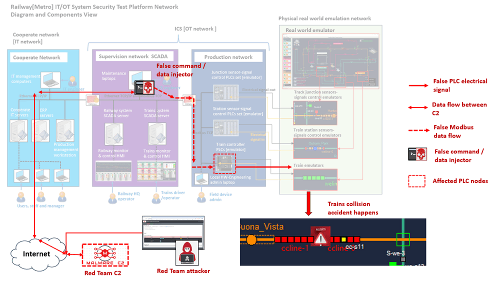
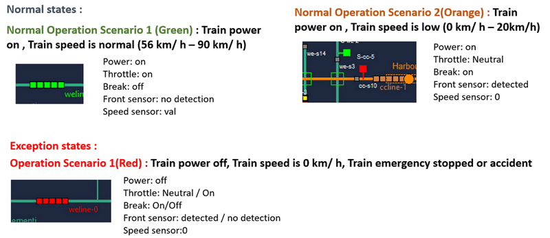
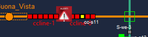
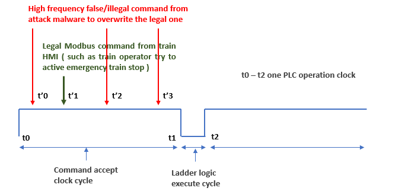
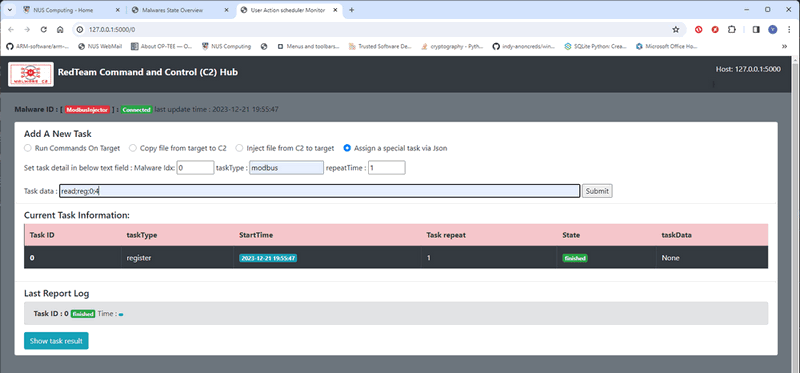
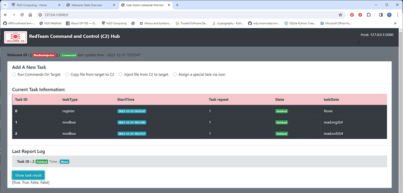
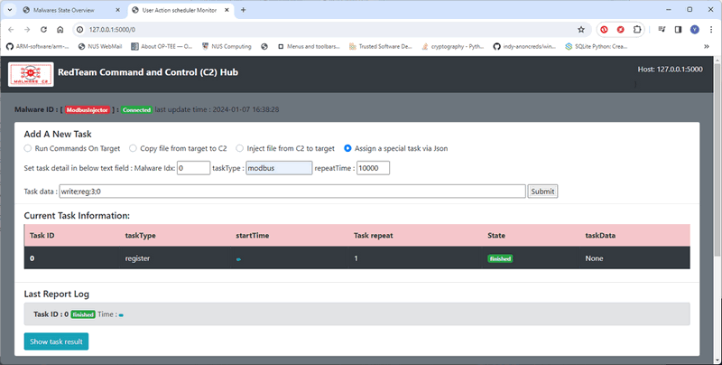
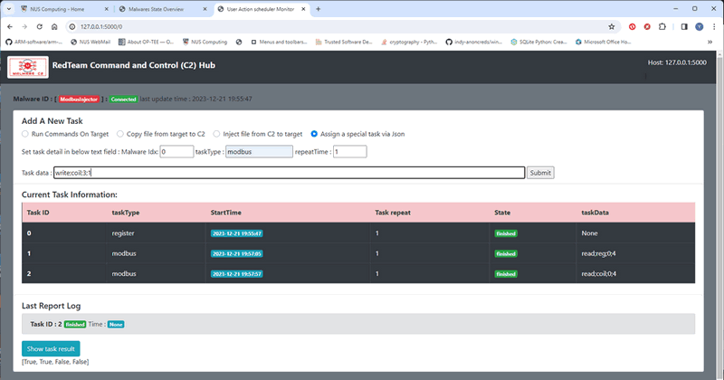
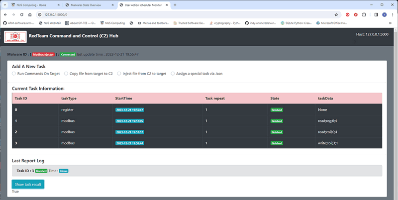

# OT Cyber Attack Demo on PLC [Case Study 01] : False Data / CMD Injection Attack Case

**Project Design Purpose** : The objective of this case study is to develop a demonstration and workshop utilizing the Railway (Metro) IT/OT System Cyber Security Test Platform, the Red Team Command and Control (C2) System, and the Modbus false data injector program for FDI & FCI attack on OT system. Our aim is to showcase how a hacker (red team member) could potentially launch an Operational Technology (OT) Cyber Attack on the programmable logic controllers (PLCs) governing railway train control, with the potential consequence of causing a collision accident between two trains. This particular attack scenario is proposed as one of the demonstration cases for the Cross Sword 2023 Test-Run, providing a realistic and controlled environment to assess the cybersecurity resilience of the railway infrastructure.

**Attacker Vector** :  `Modbus False Data` , `Command Injection`

**Matched MIRTE-CWD**: `CWE-77`, `CWE-400`

**Mapped MITRE-ATT&CK-TTP**: `T1059.008` , `T1573.001`

> Important : The demonstrated attack case is used for education and training for different level of IT-OT cyber security ICS course, please don't apply it on any real world system.

**Table of Contents**

[TOC]

- [OT Cyber Attack Demo on PLC [Case Study 01] : False Data / Cmd Injection Attack Case](#ot-cyber-attack-demo-on-plc--case-study-01----false-data---cmd-injection-attack-case)
    + [Introduction](#introduction)
    + [Background Knowledge](#background-knowledge)
        * [False Data Injection (FDI) and False Command Injection (FCI)](#false-data-injection--fdi--and-false-command-injection--fci-)
        * [Railway[Metro] IT/OT  Mini Cyber Range System](#railway-metro--it-ot--mini-cyber-range-system)
        * [Red Team C2 Emulation System](#red-team-c2-emulation-system)
        * [Modbus False Command Injector Program](#modbus-false-command-injector-program)
    + [Train Operation and Attack Procedures](#train-operation-and-attack-procedures)
      - [Train Operation Basic Background Knowledge Introduction](#train-operation-basic-background-knowledge-introduction)
      - [OT-Attack Procedures](#ot-attack-procedures)
        * [Attack Pre-condition Introduction](#attack-pre-condition-introduction)
        * [Attack Procedure Introduction](#attack-procedure-introduction)
    + [Red Team Attack Detail Steps](#red-team-attack-detail-steps)
        * [Read Holding Register State](#read-holding-register-state)
        * [Read Output Coils State](#read-output-coils-state)
        * [Initiating False Data Injection Attack](#initiating-false-data-injection-attack)
        * [Initiating False Command Injection Attack](#initiating-false-command-injection-attack)
        * [Attack Demo Video](#attack-demo-video)
    + [Problem and Solution](#problem-and-solution)
    + [MITRE CWE Matching and ATT&CK Mapping](#mitre-cwe-matching-and-att-ck-mapping)
      - [MITRE CWE(Common Weakness Enumeration) Matching](#mitre-cwe-common-weakness-enumeration--matching)

      - [MITRE ATT&CK (Adversarial Tactics, Techniques, and Common Knowledge) Mapping](#mitre-att-ck--adversarial-tactics--techniques--and-common-knowledge--mapping)

        

------

### Introduction

The attack study case comprises three sub-projects :

- Railway[Metro] IT/OT System Mini Cyber Range System [link of project document](https://github.com/LiuYuancheng/Railway_IT_OT_System_Cyber_Security_Platform)
- Red Team C2 Emulation system [link of project document](https://github.com/LiuYuancheng/Python_Malwares_Repo/tree/main/src/c2Emulator)
- Modbus false command injector program [link of project document](https://github.com/LiuYuancheng/Python_Malwares_Repo/tree/main/src/falseCmdInjector) 

In this study case, we envision a scenario where a red team attacker/hacker successfully implants the false command injector program via an IT-Attack, such as employing a phishing email, targeting one of the maintenance computers in the SCADA supervision network. The attack study case will illustrate how a red team attacker, external to the railway mini cyber range, executes an OT Modbus false data injection attack and an OT Modbus false command injection attack on the Railway train control programmable logic controller (PLC). This will be accomplished by utilizing the Red Team C2 system from the internet and successfully bypassing the firewall's detection mechanisms.

The attack detailed road map is shown below : 

Key Tactics, techniques, and procedures (TTP) of the attack: 

**Remote Attack Control**

- **Tactics** : Centralized Program Control  
- **Techniques** : Use A Command and Control (C2) system that enables attackers to manage and control compromised systems.
- **Procedures**: The red team attacker will remotely control the Malicious-Action-Programs through RTC2's web-UI, the attack control can be from any location of the internet. 

**Camouflage the Communication**

- **Tactics** : Traffic Encryption and Obfuscation
- **Techniques** : Using encryption algorithms to protect control messages and employing obfuscation methods to make the encrypted data more challenging to interpret.
- **Procedures :**To camouflage the communication, all interactions between the Malicious-Action-Programs and the Command and Control (C2) system will be disguised as standard HTTPS POST requests and responses. Notably, the package size will be kept minimal (less than 1KB) to prevent triggering the firewall's alert mechanisms related to download/upload activities.

- The Malicious-Action-Programs will execute a high-frequency injection of inaccurate data, deliberately overwriting the state values of train detection sensors read by the PLC. This continuous false data injection aims to disrupt the train collision safety mechanism.

- Following the successful execution of the false data injection attack, the Malicious-Action-Programs will transmit incorrect commands to control the train throttle, intentionally inducing a collision between trains. This multi-step approach is designed to exploit vulnerabilities in the system's detection and control mechanisms, posing a significant threat to the overall safety of the railway infrastructure.

  

------

### Background Knowledge 

Within this section, we aim to provide fundamental, general knowledge about each respective system and elucidate the Tactics, Techniques, and Procedures (TTP) associated with the attack vectors. This foundational information will serve as a primer for understanding the intricate details of the systems involved and the methodologies employed in the attack scenarios.

##### False Data Injection (FDI) and False Command Injection (FCI)

False Data Injection (FDI) and False Command Injection (FCI) are both types of cyber attacks that can target Operational Technology (OT) systems, which are used in industrial control and critical infrastructure environments. However, they differ in their objectives and methods.

1. **False Data Injection (FDI):**

   - **Objective:** The main goal of FDI is to manipulate the data within the OT system, leading to incorrect or misleading information being processed by the control systems.
   - **Method:** Attackers inject false or manipulated data into the sensors or communication channels within the OT system. This can lead to the control systems making incorrect decisions based on the compromised data.

   **Example:** In a power grid, an FDI attack might involve injecting false sensor readings that indicate lower electricity demand than actual. This could lead to incorrect decisions in adjusting power generation levels, potentially causing disruptions or even damage to the system.

2. **False Command Injection (FCI):**

   - **Objective:** FCI aims to manipulate the commands sent to the control systems, causing them to execute unauthorized or malicious actions.
   - **Method:** Attackers inject false or unauthorized commands into the communication channels or control signals of the OT system. This can lead to the control systems taking actions that are not intended or authorized.

   **Example:** In an industrial manufacturing plant, an FCI attack might involve injecting false commands that instruct a robotic arm to perform unsafe movements or alter production parameters. This could lead to physical damage to equipment or compromise the quality of manufactured products.

In summary, while both FDI and FCI attacks target OT systems, FDI focuses on manipulating the data flowing through the system to deceive decision-making processes, while FCI involves injecting false commands to manipulate the actions of the control systems. Both types of attacks can have serious consequences, potentially leading to operational disruptions, safety hazards, or damage to critical infrastructure. Security measures, such as network segmentation, encryption, and intrusion detection systems, are crucial for protecting OT systems from these types of attacks.

##### Railway[Metro] IT/OT  Mini Cyber Range System

The Railway[Metro] IT/OT System Security Mini Cyber Range serves as a compact emulation system for a railway operation company's IT/OT network. It caters to ICS researchers and instructors, providing a platform to assess and refine their IT/OT attack and defense solutions, as well as facilitating ICS security training and education. The comprehensive system is organized into four main network components, as illustrated in the diagram below:

- **Cooperate network**: This subnet replicates a typical railway company's corporate IT network, encompassing various functional servers (email, DMZ, staff management) and a production management workstation. This workstation hosts essential components such as the production log archiving database, internal document server, and operator manuals.
- **Supervision SCADA network**: Simulating the SCADA system network, this subnet features distinct SCADA data/historian servers, multiple HMI computers for system operators, and maintenance computers dedicated to ICS/OT-system engineers.
- **Production network**: This subnet houses diverse PLC simulator programs, contributing to a realistic representation of the production environment within the railway system.
- **Physical real-world emulation network**: In this subnet, railway real-world components are emulated to demonstrate the tangible effects of actual items in the real working environment.

>  Railway[Metro] IT/OT System Mini Cyber Range System Project link : [GitHub Repo](https://github.com/LiuYuancheng/Railway_IT_OT_System_Cyber_Security_Platform)

##### Red Team C2 Emulation System

The Red Team Command and Control (RTC2) server, commonly known as a C&C server, plays a pivotal role in cyber exercises and ranges. It serves as a centralized hub that red team members use to control and communicate with simulated compromised victims. This command center enables red team members or attackers to seamlessly issue instructions to the compromised machines, collect data from them, and coordinate various malicious activities within the exercise program. Our goal is to offer a comprehensive C2 server emulation solution designed for cyber exercise red team members. This solution allows them to seamlessly integrate different probing programs and malicious action programs, providing dynamic monitoring, scheduling, and control capabilities. The versatility of our solution makes it applicable across a range of fields, offering a robust platform for enhancing cyber defense readiness and testing the resilience of security measures.

> Red Team C2 Emulation System Project link : [GitHub Repo](https://github.com/LiuYuancheng/Python_Malwares_Repo/tree/main/src/c2Emulator)

##### Modbus False Command Injector Program

This program serves a dual purpose by offering both False Data Injection (FDI) and False Command Injection (FCI) capabilities, enabling red team attackers to inject Modbus control data/commands into either the Programmable Logic Controller (PLC) or Human Machine Interface (HMI) system. Illustrated below is a common example of false command/data injection:

- The Modbus data injector malware is an adaptation of the backdoor trojan program `<backdoorTrojan.py>`, where a plc-Modbus communication module is integrated. This modification enables the C2 Emulation system to remotely control and utilize the injector for launching false command injection attacks.

- The attack demonstration will spotlight the false command injector program targeting the OT-system control chain: `Train Control HMI` -> `Train Control PLC` -> `Real-world Trains in the railway system` through illicit PLC Modbus control requests. The injector will execute an illegal/false Modbus command, such as injecting the state of the train front detection sensor's holding register, prompting the PLC to generate an incorrect electrical signal to the train, resulting in a simulated train accident. This showcase underscores the potential impact of false command injection on the safety and integrity of the railway system.

> Modbus false command injector program program link: [GitHub Repo](https://github.com/LiuYuancheng/Python_Malwares_Repo/tree/main/src/falseCmdInjector)

------

### Train Operation and Attack Procedures 

#### Train Operation Basic Background Knowledge Introduction 

There will be a brief workshop to precede the implementation of the attack, providing an introduction to the fundamental control aspects of trains within the railway system. The cyber range network topology for the train simulation is depicted below:

The false data injection program will be implanted in one of the computer in the railway operational room sub-network, we named it as `rail_op_victim`. This computer's IP address is in the PLC's white list. 

**Real world Emulator Train Operation Introduction**

The trains on the real-world emulator will be under one of the below three states : 

The trains operator/driver can monitor the train state (current speed, throttle state, break state and power state) from the Train Control HMI program. 

**Train’s Senor-Power physical wire connection to PLC and auto control logic** 

The trains system incorporates two safety control mechanisms to prevent collisions:

- **Auto Collision Avoidance**: Each train is equipped with a front collision detection sensor. When this sensor identifies the presence of another train within a specified distance, it automatically triggers the brakes to slow down the train speed, ensuring collision avoidance through automated response.
- **Manual Collision Avoidance**: In addition to the automated system, train operators have the ability to intervene manually. If an operator observes irregular train speed or anticipates a potential collision, they can activate the train's emergency stop button, bringing the train to an immediate halt. This manual intervention provides an additional layer of control for addressing unforeseen situations and ensuring the safety of the railway system.

The train control PLC wire connection and the ladder logic is shown below: 

- For each Programmable Logic Controller (PLC), a dedicated coil is assigned to regulate the train's power. When this coil is deactivated, the train's throttle is set to 0, and the brakes are engaged. 
- The train sensor, linked to the PLC's input, records its state in a PLC holding register (HR0). Subsequently, the holding register triggers the ladder logic, initiating a change in the brake control coil.
- Additionally, the train speed sensor data is recorded in a separate holding register (HR1), accessible to the Human Machine Interface (HMI), which reads and displays the speed information

Under normal operating conditions, the front collision detection sensor is safeguarded against modifications via any Modbus control command from the HMI. Its settings can solely be altered by the train's dedicated electrical sensor, such as a radar.

In the event of an attack, malicious commands will be employed to unlawfully overwrite the state of the front collision sensor. This illicit manipulation aims to disrupt the train's automatic control logic, potentially leading to a collision scenario.

#### OT-Attack Procedures 

As mentioned in the preceding section, we are required to execute two types of attacks: False Data Injection (FDI) and False Command Injection (FCI), aimed at circumventing the safety mechanisms for both auto and manual train collision avoidance, ultimately leading to a simulated train accident.

- **False Data Injection (FDI)** :  In this attack, the objective is to inject inaccurate data into the PLC's sensor data record holding register, specifically targeting the front sensor detection. By manipulating this data, we aim to deceive and bypass the auto collision avoidance mechanism, tricking the system into failing to detect potential collisions.
- **False Command Injection** : In this attack scenario, our goal is to inject incorrect commands into the train power control, specifically targeting the coil responsible for controlling the train's power. By overriding the normal functioning of this control mechanism, we intend to circumvent the train operator's emergency stop action, thereby compromising the manual collision avoidance safety mechanism.

These attacks collectively illustrate the potential vulnerabilities in the train's safety controls, emphasizing the importance of robust cybersecurity measures in critical infrastructure systems.

##### Attack Pre-condition Introduction

In this demo, the false data injector has been installed in the previous IT-network attack. The victim machine (IP address) which will the run the injector is in trains control PLC ‘s allow read and allow write white list. The effected VMs in the OT network is shown below: 

The attack demo will show a false command injector program to attack the OT-system control chain: `Train Control HMI` -> `Train Control PLC` -> `Real-world Trains` in the railway system with illegal PLC Modbus control request. 

The injector will issue the illegal/false Modbus command (such as inject the train front detection sensor’s holding register’s state) to make the PLC generate the incorrect electrical signal to the train then cause the trains accident happens.

##### Attack Procedure Introduction 

To make the train collision accident happens below: 

The attack malware (injector) is designed to repetitively inject a minimum of three commands into the PLCs of two trains, maintaining a frequency higher than that of the train operators. The specific actions involve:

1. Continuously sending power cut-off commands to the front train (ccline-0), forcing it to come to a halt.
2. Persistently dispatching full throttle commands to the rear train (ccline-1), compelling it to accelerate towards the front train (ccline-0).
3. In order to prevent the collision detection sensor of the rear train (ccline-1) from triggering the train's brakes, consistently injecting the detection sensor clear command (holding register value = 0, indicating front is safe) to the ccline-1 PLC.

This sequence of commands, when executed, sets the stage for a simulated train accident. It is noteworthy that the attack may potentially be detected by the train operator if anomalies such as unusual throttle and speed readings on train ccline-1 are observed. Such detection underscores the importance of vigilance and monitoring in identifying and mitigating cyber threats to railway systems.

**How the malware to prevent the train operator do emergency stop to save train if he detected the attack/exception state:**

As shown below one PLC clock cycle : 

1. The PLC is designed to accept commands within the time interval from t0 to t1 and update its memory accordingly.
2. Subsequently, the PLC executes its ladder logic, utilizing the most recent memory state as of t1, and completes this process within a very short period, t1 - t2.
3. The attacker will send multiple false data / command in high sequency to try to overwrite the train operator’s correct control command. Unless the operator can press the train emergency stop button supper fast (which is impossible faster than the malware program), then he will not be able to stop the train accident.

------

### Red Team Attack Detail Steps

Given that the red team attackers operate outside the railway cyber range network, they rely on the attack control Command and Control (C2) system to execute the assault. As detailed in the Attack Pre-condition Introduction section, the false data injection program has been previously deployed on one of the maintenance computers within the cyber range. Consequently, when the red team attacker accesses the C2 system, they will see the false data/cmd injection program has been registered in the C2 as shown below : 

Before start to inject the data / command, the red team attacker needs to read the PLC data first. To assign a PLC read task to the injector, select link to task detail => Assign a special task via Json (in the malware tasks control page).

##### Read Holding Register State

Select the false Modbus data injector page, then select the `Assign a special task via Json`, then fill in the task detail : 

- TaskType: `modbus`
- Repeat: `int <number of the injection repeat times>`
- Tasks data: `read;reg;<start Holding register index>;<offset>`

Read PLC holding register state :

Press the `submit` button, when the false data injector reports the task finished, check the result by click the `Show task result` button (As shown below the red team attacker can read the holding register data from HR0 to HR3) : 

After several tries, the attacker can identify which holding registers are used in the PLC.

##### Read Output Coils State

Same as the previous steps, the red team attacker can fill in the task detail below to read the coil state to identify all the coils used by the PLC : 

- TaskType: `modbus`
- Repeat: `int <number of the injection repeat times>`
- Tasks data: `read;coil;<start coil index>;<offset>`

##### Initiating False Data Injection Attack

To execute the false data injection attack, the red team must override the recorded information in the train detection sensor's holding register. This involves consistently sending the "not detected" value (0) to perpetually overwrite the feedback data (1) from the train detection sensor.

- TaskType: `modbus`
- Repeat: `100000`
- Tasks data: `write;reg;3;0`

After injected the sensor data the attacker can override the auto collision avoidance mechanism.

##### Initiating False Command Injection Attack

To carry out the false command injection attack, the red team must manipulate the train emergency control coil's value. This entails continually sending the "emergency stop OFF" value to the corresponding Programmable Logic Controller (PLC).

- TaskType: `modbus`
- Repeat: `10000`
- Tasks data: `write;coil;3;1`

Press the `submit` button, when the false data injector report the task finished, check the result by click the `Show task result` button : 

##### Attack Demo Video

Upon completion of the initiation of False Data Injection (FDI) and False Command Injection (FCI), the tangible impact of the attack will be demonstrated in the video below:

https://www.youtube.com/watch?v=J0qpOhigNL8&t=16s

------

### Problem and Solution

Refer to `doc/ProblemAndSolution.md`

------

### MITRE CWE Matching and ATT&CK Mapping

Massachusetts Institute of Technology Research and Engineering (MITRE) 

#### MITRE CWE(Common Weakness Enumeration) Matching

**CWE-77**

- **CWE Name**: Improper Neutralization of Special Elements used in a Command ('Command Injection')
- **CWE Match**: In the case study scenario, the attacker may exploit vulnerabilities in the Modbus communication protocol to forge requests to the PLC from the traffic capture file, injecting false data and commands. This weakness security action can match to the `CWE-77: Improper Neutralization of Special Elements used in a Command ('Command Injection')`. 
- **CWE Detail**: This CWE relates OT product constructs all or part of a command using externally-influenced input from an upstream component, but it does not neutralize or incorrectly neutralizes special elements that could modify the intended command when it is sent to a downstream component. Link: https://cwe.mitre.org/data/definitions/77.html

**CWE-400** 

- **CWE Name**: Uncontrolled Resource Consumption ('Resource Exhaustion')

- **CWE Match**: In this case study scenario, the attacker may overwhelm the PLC's resources (connected input sensor's value) with false data or commands, causing disruption or manipulation of train control operations. This weakness security state can match to the `CWE-400: Uncontrolled Resource Consumption ('Resource Exhaustion')`

- **CWE Detail**: This CWE involves attackers exploiting weaknesses in the target system's resource management, leading to resource exhaustion and potential denial of service or system instability.  Link: https://cwe.mitre.org/data/definitions/400.html

  

#### MITRE ATT&CK (Adversarial Tactics, Techniques, and Common Knowledge) Mapping

**T1059.008: Network Device Client Command and Scripting Interpreter**

- FCI and FDI could be part of the broader tactic of "Execution" (TA0002) use the network device client to do the command interpreter attack, which involves techniques used by adversaries to run malicious code on / targeting a victim's system. Within this tactic, "Command and Scripting Interpreter" (T1059) could be considered the closest match, as it involves the exploitation of command-line interpreters, which is similar to the concept of injecting commands.

- Link: https://attack.mitre.org/techniques/T1059/008/

**T1573.001: Encrypted Channel: Symmetric Cryptography**

- The attacker use https symmetric cryptography to encrypt communications between the False data injection program and the Red Team C2 system. This technique involves adversaries using symmetric cryptography to establish encrypted channels for command and control (C2) communication. 

- Link: https://attack.mitre.org/techniques/T1573/001/

  

------

> Last edit by LiuYuancheng(liu_yuan_cheng@hotmail.com) at 06/01/2024, if you have any problem, please send me a message.  Copyright (c) 2023 LiuYuancheng