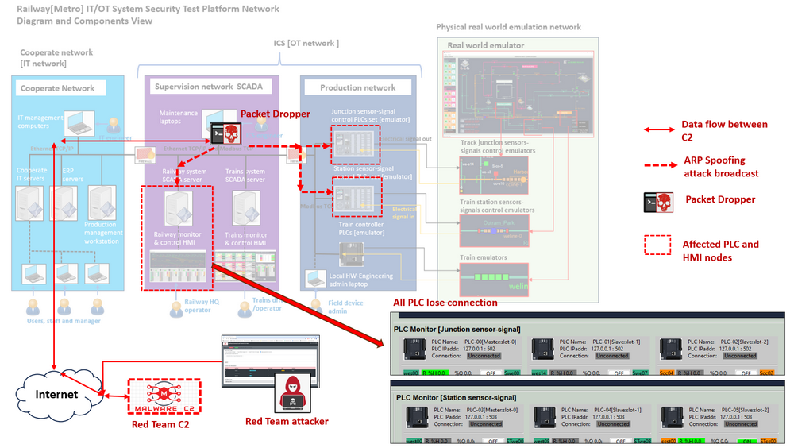
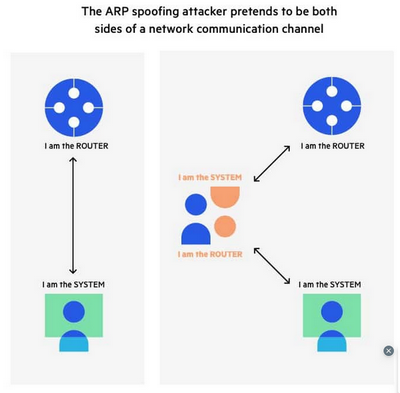
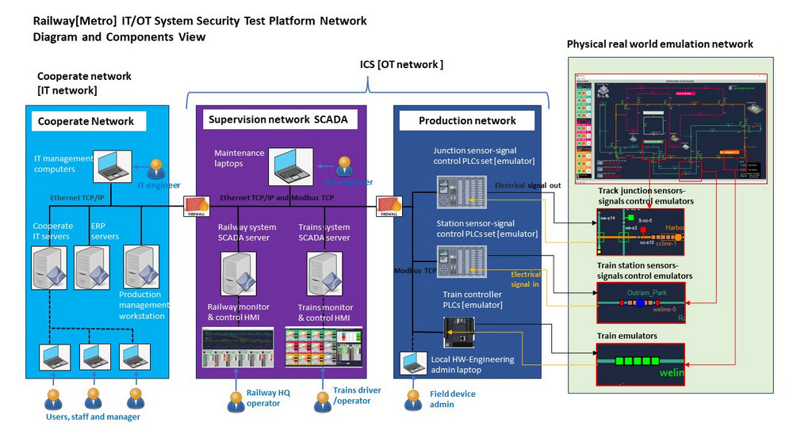
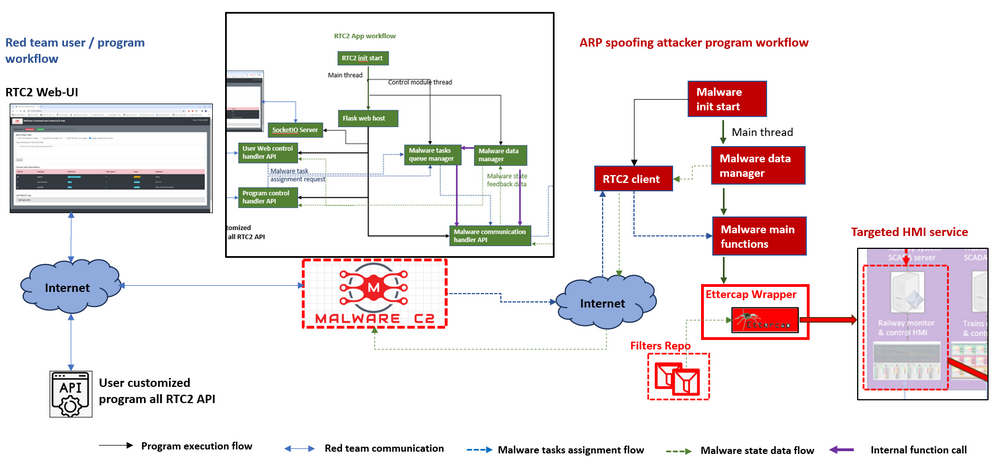
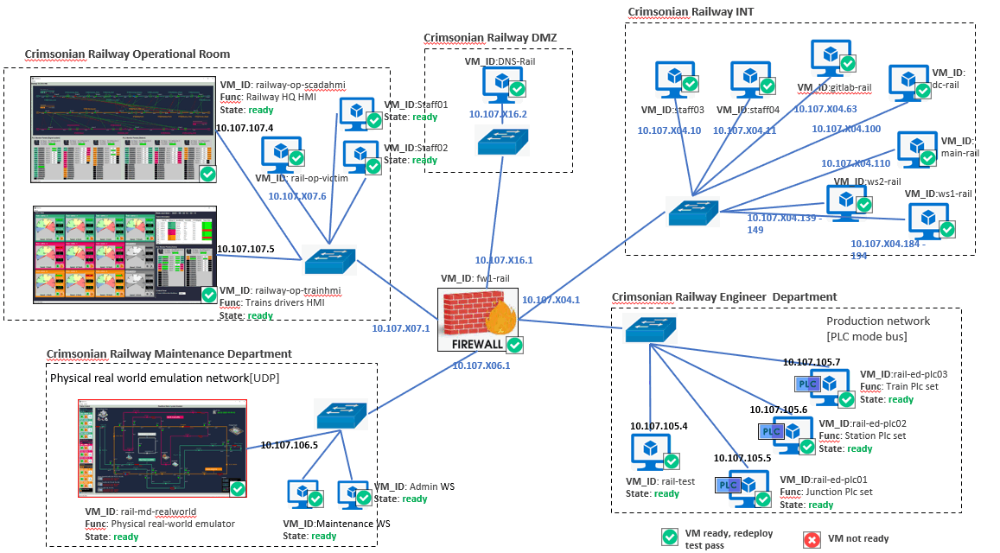
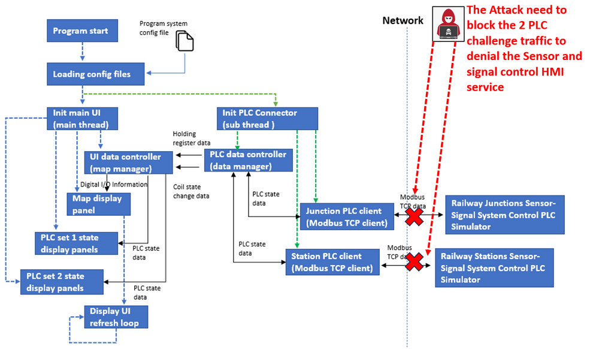
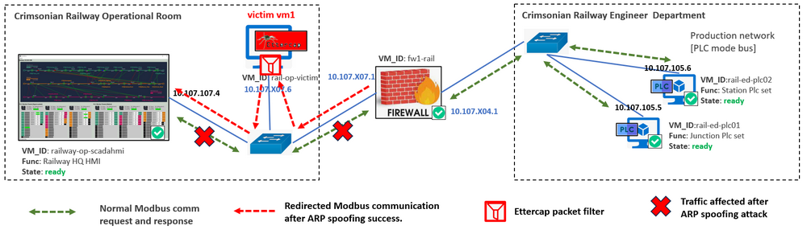

# OT Cyber Attack Demo on HMI  [Case Study 02] : ARP Spoofing Attack Case

**Project Design Purpose** : The objective of this case study is to develop a workshop which utilizing the Railway (Metro) IT/OT System Cyber Security Test Platform (mini cyber range), the Red Team Command and Control (C2) System and the Ettercap Wrapper for demonstrating the APR Spoofing attack on OT system.  Our aim is to showcase how a hacker (cyber range red team member) could potentially launch an ARP Spoofing Attack on the OT system Human Machine Interface (HMI) which caused the part of the Operation Room HQ service offline.  This particular attack scenario is proposed as one of the demonstration cases for the Cross Sword 2023 Test-Run, providing a realistic and controlled environment to assess the cybersecurity resilience of the railway infrastructure.

**Attacker Vector** :  `ARP Spoofing` , `Network Traffic Blocking` , `DoS`

**Matched MIRTE-CWD**:  `CWE-284` , `CWE-494` , `CWE-300` , `CWE-937`

**Mapped MITRE-ATT&CK-TTP**: `T1562.001` , `T1573.002`, `T1499.002`

> Important : The demonstrated attack case is used for education and training for different level of IT-OT cyber security ICS course, please don't apply it on any real world system.

**Table of Contents**

[TOC]

- [OT Cyber Attack Demo on HMI  [Case Study 02] : ARP Spoofing Attack Case](#ot-cyber-attack-demo-on-hmi---case-study-02----arp-spoofing-attack-case)
    
    + [Introduction](#introduction)
        
        * [Key Tactics, techniques, and procedures (TTP) of the attack](#key-tactics--techniques--and-procedures--ttp--of-the-attack)
    + [Background Knowledge](#background-knowledge)
        * [ARP Spoofing Attack](#arp-spoofing-attack)
        * [Railway[Metro] IT/OT Mini Cyber Range System](#railway-metro--it-ot-mini-cyber-range-system)
        * [Red Team C2 Emulation System And Ettercap Packet Dropper](#red-team-c2-emulation-system-and-ettercap-packet-dropper)
    + [Railway Operation and Attack Procedures](#railway-operation-and-attack-procedures)
      - [Train Operation Basic Background Knowledge Introduction](#train-operation-basic-background-knowledge-introduction)
        * [Railway Sensor-Signal SCADA-HMI Introduction](#railway-sensor-signal-scada-hmi-introduction)
      - [OT-Cyber-Attack Procedures](#ot-cyber-attack-procedures)
    + [Red Team Attack Detail Steps](#red-team-attack-detail-steps)
        * [Start APR Spoofing Packet Drop Attack from C2](#start-apr-spoofing-packet-drop-attack-from-c2)
        * [Attack Demo Video](#attack-demo-video)
      
      - [Problem and Solution](#problem-and-solution)
    + [MITRE CWE Matching and ATT&CK Mapping](#mitre-cwe-matching-and-att-ck-mapping)
      - [MITRE CWE(Common Weakness Enumeration) Matching](#mitre-cwe-common-weakness-enumeration--matching)
      - [MITRE ATT&CK (Adversarial Tactics, Techniques, and Common Knowledge) Mapping](#mitre-att-ck--adversarial-tactics--techniques--and-common-knowledge--mapping)


------

### Introduction

The attack study case comprises three sub-projects :

- Railway[Metro] IT/OT System Mini Cyber Range System [> Link of project document](https://github.com/LiuYuancheng/Railway_IT_OT_System_Cyber_Security_Platform)
- Red Team C2 Emulation system [link of project document](https://github.com/LiuYuancheng/Python_Malwares_Repo/tree/main/src/c2Emulator)
- Ettercap Wrapper program [link of project document](https://github.com/LiuYuancheng/Python_Malwares_Repo/tree/main/src/ettercapWrapper)

In this study case, we envision a scenario where a red team attacker/hacker successfully implants the Packet Dropper (a wrapper program of MITM Tool Ettercap) via an IT-Network-Attack (such as employing a phishing email) which targeting one of the maintenance computers in the SCADA supervision network. The attack study case will illustrate how a red team attacker ( who is external of the railway mini cyber range ) executes Ettercap to broadcast the fake ARP to one HQ operation HMI computer and the related PLCs, then applying the Modbus-TCP packet filter to drop two types of specific communication data ( HMI-to-PLC-request + PCL-to-HMI-Response)  to caused  one railway Sensor-Signal-HMI in Operation-Room offline. This will be accomplished by utilizing the Red Team C2 system from the internet and successfully bypassing the firewall's detection mechanisms.

The attack detailed road map is shown below : 



##### Key Tactics, techniques, and procedures (TTP) of the attack

Based on the attack detailed road map there will 4 kinds TTP are included in the ARP spoofing attack scenario : 

**Remote Attack Control**

- **Tactics** : Centralized Program Control  
- **Techniques** : Use a Red Team Command and Control (RTC2) system that enables attackers to manage and control compromised systems/nodes/devices.
- **Procedures**: The red team attackers will remotely control the Malicious-Action-Programs through RTC2's web-UI/http-API, the attack control can be from any location of the internet. 

**Camouflage the Communication**

- **Tactics** : Traffic Encryption and Obfuscation
- **Techniques** : Using encryption algorithms to protect RTC2 control messages and employing obfuscation methods to make the encrypted data more challenging to be interpreted.
- **Procedures :**To camouflage the communication, all interactions between the Malicious-Action-Programs and the Command and Control (C2) system will be disguised as standard HTTPS POST requests and responses, the key control message will be encrypted via pre-set session key. Notably, the package size will be kept minimal (less than 1KB) to prevent triggering the firewall's alert mechanisms related to download/upload activities.

**ARP Cache Poisoning**

- **Tactic:** Manipulating ARP Tables.
- **Technique:** Sending forged ARP packets to associate the attacker's MAC address with the IP address of a target system, causing the ARP cache on other devices to be poisoned.
- **Procedures** : Use Ettercap to broadcast the fake ARP message to the targeted operation room HMI host machine and the switch (router) of the supervision network to poisoning the ARP cache table of these 2 nodes to redirect the traffic between HMI host and switch/router to the attack launch machine.

**Denial of Service (DoS)**

- **Tactic:** Disrupting normal network operations.

- **Technique:** Flooding the network with ARP spoofed packets can lead to a breakdown in network communication, causing denial of service for legitimate users.

- **Procedures** : After the ARP Cache Poisoning attack successful, apply the specific network packet drop filter (Modbus) to packets to denial/block the HMI to PLC communicate without make influence of other traffic. 

  

------

### Background Knowledge 

Within this section, we aim to provide fundamental, general knowledge about each respective system and elucidate the Tactics, Techniques, and Procedures (TTP) associated with the attack vectors. This foundational information will serve as a primer for understanding the intricate details of the systems involved and the methodologies employed in the attack scenarios.

##### ARP Spoofing Attack

Address Resolution Protocol (ARP) is a protocol that enables network communications to reach a specific device on the network. ARP translates Internet Protocol (IP) addresses to a [Media Access Control ](https://www.imperva.com/learn/application-security/broken-object-level-authorization-bola/)(MAC) address, and vice versa. Most commonly, devices use ARP to contact the router or gateway that enables them to connect to the Internet.

ARP (Address Resolution Protocol) spoofing, also known as ARP poisoning, is a network attack in which an attacker sends fake ARP messages to the local area network. The goal of ARP spoofing is to associate the attacker's MAC (Media Access Control) address with the IP address of a legitimate network device, causing network traffic to be redirected to the attacker. This can lead to various malicious activities, such as man-in-the-middle attacks, eavesdropping, or session hijacking. A Basic APR spoofing attack diagram is shown below: 



Reference: https://www.imperva.com/learn/application-security/arp-spoofing/

##### Railway[Metro] IT/OT Mini Cyber Range System

For the Railway IT/OT System general introduction please refer refer to the [study case 1](OT_attack_case1_falseCmdInjection.md), the cyber range system diagram is shown below:



**Human-Machine Interface**: In the context of industrial automation and control systems, OT HMI refers to the Human-Machine Interface used in Operational Technology (OT) environments. OT encompasses the technologies and systems used to monitor and control physical devices, processes, and infrastructure in sectors like manufacturing, energy, utilities, and transportation.

**Targeted Host/App/Service** : In this attack case study, as shown in the the `Attack detailed road map`  the target is one of the HMI-App (monitoring junction and station sensor and signal) running in the Railway IT/OT Mini Cyber Range. The HMI program is running on one work station in the system's supervision network ( operation room ). It provides a graphical representation of the operational status, real-time data, and control options, allowing operators to monitor and manage industrial processes efficiently  monitor for the HQ operator to monitor the whole railway tracks sensors-signal auto control state. The Main UI is shown below :


The Sensor-Signal monitor HMI contents below components and function:

- A train sensors-signal relation map to show sensors' state, signals state and the sensors-signals auto control relation ship (tracks-cross-junction and train-stations). 
- Three PLC panels to show the junction-sensor-signal control system's Digital Input/Output state, PLC holding register state and the PLC Coils state. 
- Three PLC panel to shoe the station-sensor-signal control system's Digital Input/Output state, PLC holding register state and the PLC Coils state. 

For the HMI system detail please refer to this document : [SCADA-HMI-1_DOC](https://github.com/LiuYuancheng/Railway_IT_OT_System_Cyber_Security_Platform/blob/main/doc/scadaHMI_readme.md)

##### Red Team C2 Emulation System And Ettercap Packet Dropper

For the The Red Team Command and Control (RTC2) server, please refer to the introduction in case study 1

This Ettercap wrapper ARP Spoofing malware is designed for red team attackers applying different kinds of packet filters on the network traffic via Ettercap's ARP spoofing function on the router/switch so they can easily launch the packet drop, traffic block or even man in the middle attack. The ARP spoofing attacker is extended from the standard c2BackdoorTrojan module `<c2TestMalware>` by adding our customized Ettercap Wrapper module, so the C2 Emulation system can control it broadcast the specific ARP poisoning message to the railway HMI node, the operational room subnet's switch/router and even the related connected PLC sets. The RTC2 control and attack workflow is shown below: 



The attacker will apply a packets drop filter to the traffic between the Railway-SCADA-HMI and 2 PLC sets (traffic junction sensor-signal control PLCx3 and the station sensor-signal) to block all the Modbus-TCP traffic packets to denial the railway HMI's state monitoring service. 

> Ettercap wrapper attack program repo: [GitHub Repo ](https://github.com/LiuYuancheng/Python_Malwares_Repo/tree/main/src/ettercapWrapper)


------

### Railway Operation and Attack Procedures 

#### Train Operation Basic Background Knowledge Introduction 


There will be a brief workshop to precede the implementation of the attack, providing an introduction to the fundamental control aspects of trains within the railway system. The cyber range network topology for the train simulation is depicted below:



##### Railway Sensor-Signal SCADA-HMI Introduction

The HMI program contents 2 main parts: 

- **Main user interface** : A UI-map to show the junctions and stations' sensor-signal state, junction control PLC set [PLC-00, PLC-01 and PLC-02] state with the digital I/O information, station control PLC set [PLC-03, PLC-04 and PLC-05] state with the digital I/O information.
- **PLC communication thread** : communicate with the Railway Junctions Sensor-Signal System Control PLC Simulator and Railway Stations Sensor-Signal System Control PLC Simulator through Modbus TCP to get the OT data.

This is the program modules workflow diagram: 



So during the attack, to denial the HMI service, we need to drop both of the 2 Modbus-TCP communication channel. 

#### OT-Cyber-Attack Procedures 

In this demo, the attack tool Ettercap will be pre-installed by the previous IT-system-attack. As introduced in the previous section, we are required to implement 2 types of attacker : Arp spoofing and packet drop. The effected VMs in the OT network is shown below: 



The attack demo will show a Ettercap wrapper program to do the ARP poisoning to the railway  OT sensor-signal system control chain: `Railway Sensor-Signal Control HMI` -> `SCADA sypervision network router` -> `Junction control PLCs & sitation control signals` . The attacker will apply a packets filter (As the simple example shown below) :

```
#-----------------------------------------------------------------------------
# Name:        arp_spoofing.filter
#
# Purpose:     This filter is used to do the arp spoofing attack on the Modbus 
#              channel between SCADA-HMI and PLC01. It will drop all the 
#              Modbus packets to cut off the PLC control channel.
#
# Author:      Yuancheng Liu
#
# Version:     v_0.1
# Created:     2019/10/02
# Copyright:   Copyright (c) 2019 LiuYuancheng
# License:     MIT License 
#-----------------------------------------------------------------------------
if (ip.proto == TCP && tcp.dst == 502 && ip.dst == '10.107.105.5') {
    # Filtered all the Modbus-TCP packets incoming from PLC to HMI 
    drop();
    msg("Drop the HMI Modbus response packet!\n");
}
if (ip.proto == TCP && tcp.dst == 502 && ip.src == '10.107.107.5') {
    # Filtered all the Modbus-TCP packets outgoing from HMI to HMI
    drop();
    msg("Drop the PLC Modbus request packet!\n");
}
#-----------------------------------------------------------------------------
# Filter Usage:
# - compile : etterfilter arp_spoofing.filter -o atk.ef
```

To the traffic between the Railway-SCADA-HMI and 2 PLC set (all 6 PLCS in junction and station network) to drop all the Modbus-TCP traffic packets to cut off the connection of railway state monitoring service.

**Observation during the attack :**

- When the attack happens, the Railway SCADA HMI PLC connection indicators will show total lose connection. All the data on the Railway-SCADA-HMI will not update.
- The railway HQ operator is able to detect the attack. But if he tries to use ping, ssh or use other not Modbus(TCP-port 502) to test the network connection, he will not find any network problem. (As the filter only drop the specific protocol packet)

The attack effect (observation) detail is shown below:


When the attack happens, the railway HQ operator may observe below situation :

- All the data on the railway-SCADA-HMI will not update. 

- The PLC connection indicators on railway-SCADA-HMI will show lose connection (change from green color to gray color). 


------

### Red Team Attack Detail Steps

Given that the red team attackers operate outside the railway cyber range network, they rely on the attack control Command and Control (C2) system to execute the assault. As detailed in the Attack Pre-condition Introduction section, the ARP spoofing attacker program has been previously deployed on one of the maintenance computers within the cyber range. Consequently, when the red team attacker accesses the C2 system, they will see the ARP spoofing attacker program "packetDropper" has been registered in the C2 as shown below : 


##### Start APR Spoofing Packet Drop Attack from C2

Select the PacketDropper control page, then select the **Assign a special task via Json**, then fill in the task detail : 

- TaskType: `packetDrop`
- Repeat: `1`
- Tasks data: `packetDropper <filter name>`


Press the `submit` button, when the Ettercap wrapper report the task running, the Ettercap will apply the filter to keep blocking the traffic which incoming or outgoing to/from the target victim node. For the filter config information, please refer to the `filter.json` file, below is one dropper filter example, you can create your own filter and put in the filters folder and give a filter unique name in the `filter.json` file so you can apply it on the traffic:

```
"packetDropper" : {
    "ipaddress": "10.107.107.5",
    "protocalType": "TCP",
    "port":502,
    "description": "Drop all the packets from and to the IP address",
    "filterFile": "atk.ef"
}
```

##### Attack Demo Video

To check the demo video, please refer to this link in my YouTube channel: https://www.youtube.com/watch?v=QmB0nJU1_q4


------

#### Problem and Solution

Refer to `doc/ProblemAndSolution.md`


------

### MITRE CWE Matching and ATT&CK Mapping

Massachusetts Institute of Technology Research and Engineering (MITRE) 

#### MITRE CWE(Common Weakness Enumeration) Matching


**CWE-284**

- **CWE Name**: Improper Access Control
- **CWE Match**: In this scenario, the attacker exploits improper access control to broadcast fake ARP messages through the HQ Operation Room's switch and apply Modbus-TCP packet filters, leading to disruption of communication between the HMI and PLCs. The security weakness can match to the  `CWE-284: Improper Access Control`
- **CWE Detail**: This CWE involves vulnerabilities related to inadequate access control mechanisms, allowing unauthorized users to access or manipulate resources. Link: https://cwe.mitre.org/data/definitions/284.html


**CWE-494**

- **CWE Name**: Download of Code Without Integrity Check
- **CWE Match**:  In this scenario, the attacker may use the Red Team C2 system remote control the victim(maintenance engineer's laptop) to download and execute the packet dropper filter for ARP spoofing without integrity checks by the OT subnet firewall. The security weakness can match to the `CWE-494: Download of Code Without Integrity Check`
- **CWE Detail**: This CWE involves vulnerabilities where an attacker can cause the download of code from the internet without proper integrity checks, potentially allowing the execution of malicious code. Link: https://cwe.mitre.org/data/definitions/494.html


**CWE-300**

- **CWE Name**: Channel Accessible by Non-Endpoint ('Man-in-the-Middle')

- **CWE Match**:  In this scenario, the attacker uses a man-in-the-middle tool Ettercap to perform ARP attack by intercepting and modifying ARP messages, leading to the disruption of communication between the HMI and PLCs. The security weakness can match to the `CWE-300: Channel Accessible by Non-Endpoint ('Man-in-the-Middle')`

- **CWE Detail**: This CWE involves vulnerabilities where attackers can intercept or modify communication between two parties without their knowledge. Link: https://cwe.mitre.org/data/definitions/300.html

  

**CWE-937**

- **CWE Name**: OWASP Top Ten 2013 Category A5 - Security Misconfiguration

- **CWE Match**: In the scenario, the attacker's ability to  bypass firewall detection mechanisms and manipulate subnet's switch and victim's ARP tables, this exploit the security misconfigurations in the firewall and network infrastructure. The security weakness can match to the `CWE-937: OWASP Top Ten 2013 Category A5 - Security Misconfiguration`

- **CWE Detail**: This CWE involves weaknesses related to security misconfigurations, such as default configurations, insecure configurations, or incomplete configurations, which can lead to security vulnerabilities or operational failures. Link: https://cwe.mitre.org/data/definitions/937.html

  

#### MITRE ATT&CK (Adversarial Tactics, Techniques, and Common Knowledge) Mapping

**Initial Access (TA0001) > T1562.001: Impair Defenses: Disable or Modify Tools**

- The attacker modifies network traffic using MITM attack tool Ettercap to disrupt communication between the HMI and PLCs, impairing defenses and gaining initial access to the network. 
- Link: https://attack.mitre.org/techniques/T1562/001/

**Command and Control (TA0002) > T1573.002: Encrypted Channel: Asymmetric Cryptography**

- The attacker and the ARP Spoofing program utilizes encrypted channels to communicate with the Red Team C2 system, maintaining stealth and security during the attack.
- Link: https://attack.mitre.org/techniques/T1573/002/

**Impact (TA0004) > T1499.002: Endpoint Denial of Service**

- The attacker disrupts communication between the HMI and PLCs by dropping specific Modbus-TCP communication data, causing the railway Sensor-Signal-HMI in the Operation Room to go offline.
- Link: https://attack.mitre.org/techniques/T1499/


------

> Last edit by LiuYuancheng(liu_yuan_cheng@hotmail.com) at 13/01/2024, if you have any problem, please send me a message.  Copyright (c) 2023 LiuYuancheng