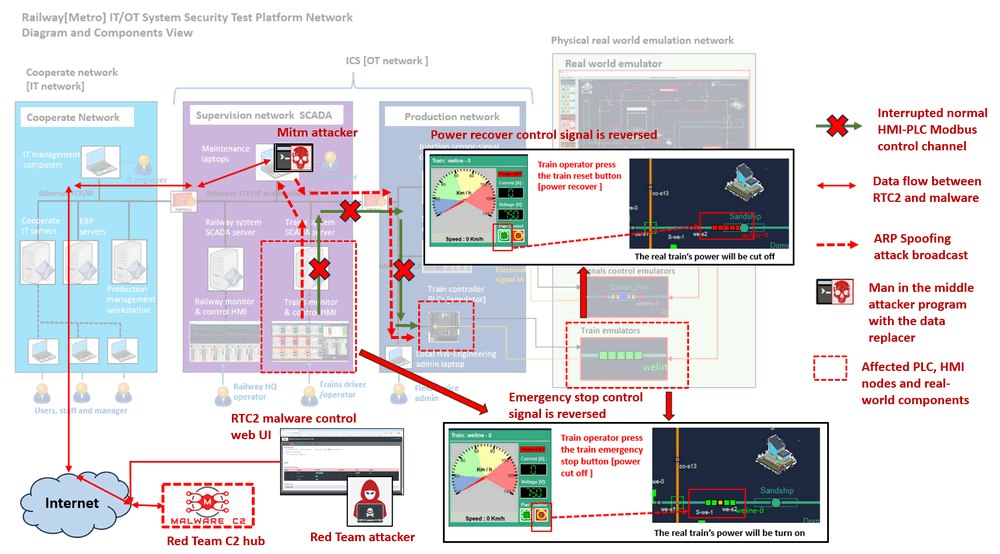
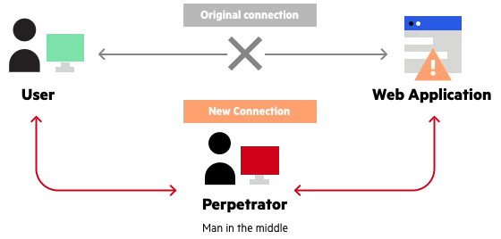
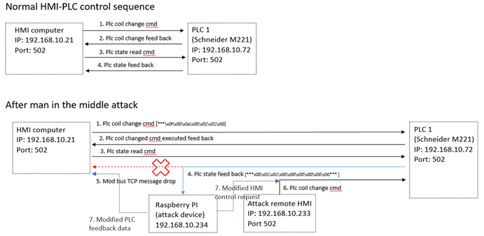
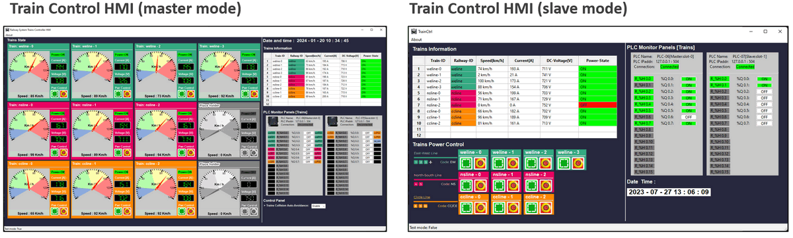
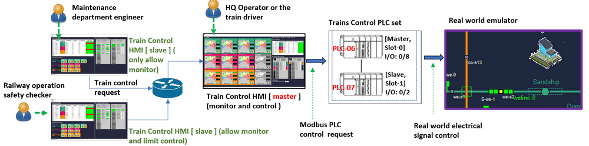
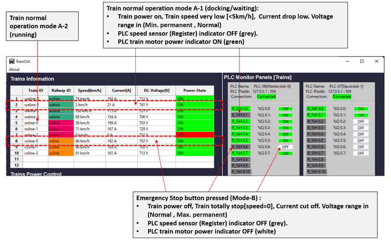
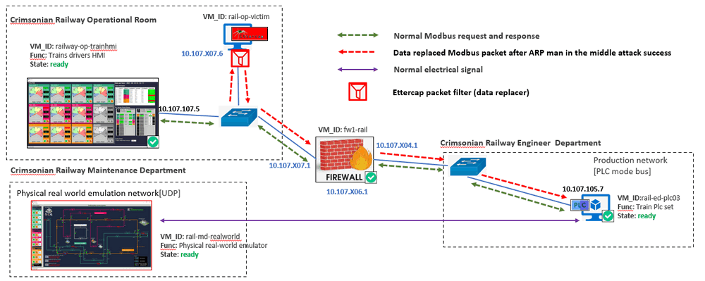
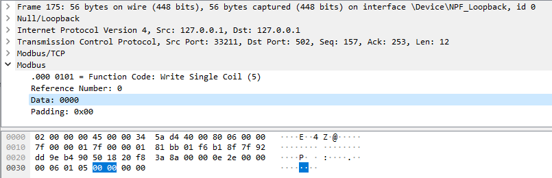
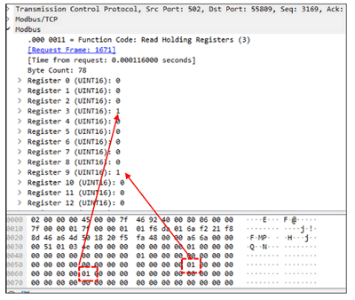
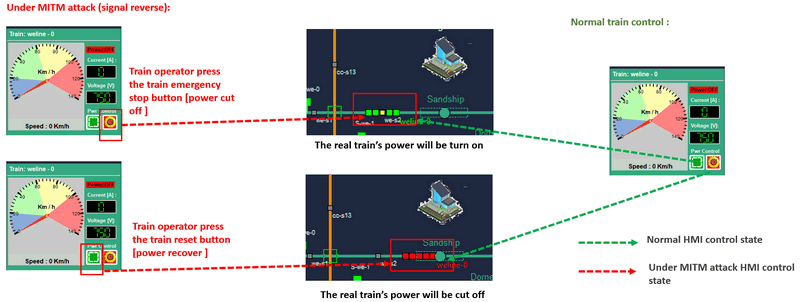

# OT Cyber Attack Demo on HMI-PLC control Chain [ Case Study 04 ] : Man in the middle Attack Case

**Project Design Purpose** : The objective of this case study is to develop a workshop which utilizing the Railway (Metro) IT/OT System Cyber Security Test Platform (mini cyber range), the Red Team Command and Control (C2) System and the Ettercap Wrapper for demonstrating the Man-in-the-Middle (MITM) attack on OT system.  Our aim is to showcase how a hacker (cyber range red team attacker) could potentially launch an MITM attack to modify the control command between HMI and PLC to caused the train accident situation. This particular attack scenario is proposed as one of the demonstration cases for the [Cross Sword 2023](https://www.linkedin.com/posts/natoccdcoe_crossedswords-activity-7140986334961217536-7dM5/?utm_source=share&utm_medium=member_desktop) NATO CCECOE Global Exercise Test-Run, providing a realistic and controlled environment to assess the cybersecurity resilience of the railway infrastructure. It is an advanced ARP spoofing attack scenario of the [Case Study 2](OT_attack_case2_arpSpoofingAttack.md) and the MITM is more difficulty for the railway HQ operator to detect. 

**Attacker Vector** :  Man-in-the-Middle (MITM) attack / ARP Spoofing

> Important : The demonstrated attack case is used for education and training for different level of IT-OT cyber security ICS course, please don't apply it on any real world system.

[TOC]

------

### Introduction

The cyber attack case study comprises three sub-projects we developed:

- Railway[Metro] IT/OT System Mini Cyber Range System [> Link of sub-project document](https://github.com/LiuYuancheng/Railway_IT_OT_System_Cyber_Security_Platform)
- Red Team C2 Emulation system [> Link of sub-project document](https://github.com/LiuYuancheng/Python_Malwares_Repo/tree/main/src/c2Emulator)
- Ettercap Wrapper MITM attack program [> Link of sub-project document](https://github.com/LiuYuancheng/Python_Malwares_Repo/tree/main/src/ettercapWrapper)

In this case study, we envision a scenario where a red team attacker/hacker has successfully implanted the packet parser and data replacer (a wrapper program of MITM Tool Ettercap) via an IT-Network-Attack (such as employing a phishing email) which targeting one of the maintenance computers in the SCADA supervision network.  The attack case study will illustrate how a red team attacker ( who is external of the railway mini cyber range ) executes Ettercap wrapper to launch the ARP spoofing attack first, then applying the Modbus packet parser to find the specific HMI to PLC control data stream and use the data replacer to modify the PLC coils' control bytes to reverse the final real world electrical signal. This will be accomplished by utilizing the Red Team C2 Emulation system from the internet and successfully bypassing the firewall's detection mechanisms.

The cyber attack detailed road map is shown below : 



#### Key Tactics, techniques, and procedures (TTP) of the attack

Based on the attack detailed road map above, there will be 4 kinds main TTP included in the Man-in-the-Middle attack scenario : 

##### ARP Spoofing and Poisoning 

- **Tactic:** Redirecting network traffic by manipulating Address Resolution Protocol (ARP) tables.
- **Technique**: Broadcasting fake ARP messages to associate the attacker's MAC address with the IP address of a legitimate device, causing traffic to be redirected through the attacker.
- **Procedures**: The MITM attack program will use Ettercap to launch APR spoofing attack to redirect the HMI to PLC communication to the attack host first, then forward the modified packet to the PLC(s). 

##### Packet Injection and Modification

- **Tactic**: Introducing malicious packets into the communication stream or modify the normal packet .
- **Technique**: Injecting crafted packets into the network to manipulate data, disrupt communication, or execute unauthorized commands.
- **Procedures**: The MITM attack program employs a packet data replacement filter to alter the power control bytes within the HMI to PLC Modbus-TCP communication stream. Subsequently, it injects the meticulously crafted packet into the corresponding PLC, disrupting the normal control sequence of the PLC. This manipulation of data at the packet level introduces unauthorized changes to the communication flow, leading to potential disruptions in the control and coordination of the PLC's operations.

##### Remote Attack C2 Control

- **Tactics** : Centralized Malicious-Action-Programs Control  
- **Techniques** : Use a Red Team Command and Control (RTC2) system that enables attackers to manage and control compromised systems/nodes/devices.
- **Procedures**: The red team attackers will remotely control the Malicious-Action-Programs (Ettercap wrapper) through RTC2's web-UI/http-API, the attack control can be from any location of the internet. 

##### Camouflage the Communication

- **Tactics** : Traffic Encryption and Obfuscation
- **Techniques** : Using encryption algorithms to protect RTC2 control messages and employing obfuscation methods to make the encrypted data more challenging to be interpreted.
- **Procedures :** To camouflage the communication, all interactions between the Malicious-Action-Programs and the Command and Control (C2) system will be disguised as standard HTTPS POST requests and responses, the key control message will be encrypted via pre-set session key. Notably, the package size will be kept minimal (less than 1KB) to prevent triggering the firewall's alert mechanisms related to download/upload activities.


------

### Background Knowledge 

Within this section, we aim to provide fundamental, general knowledge about each respective system and elucidate the Tactics, Techniques, and Procedures (TTP) associated with the attack vectors. This foundational information will serve as a primer for understanding the intricate details of the systems involved and the methodologies employed in the attack scenarios.

##### Man-in-the-Middle (MITM) attack for data modification

A Man-in-the-Middle (MITM) attack is a general term for when a perpetrator positions himself in a conversation between two peers such as a user and an application—either to eavesdrop or to impersonate one of the parties, making it appear as if a normal exchange of information is underway. A general MITM attack diagram is shown below :



> Reference: https://www.imperva.com/learn/application-security/man-in-the-middle-attack-mitm/

MITM attack can be executed in various ways, In our case study scenario, the main attack vector is `Packet Injection and modification` (data modification). Generally there are five steps for a red team attacker/hacker to implement a successful MITM data modification attack:

1. **Interception:** The attacker positions themselves between the communication channels of two parties. This could happen on a network, at a Wi-Fi hotspot, or even through compromised network devices.
2. **Packet Sniffing:** The attacker captures the data packets passing between the two parties. This could include login credentials, sensitive information, or any other data being transmitted.

3. **Data Modification:** The attacker can modify the intercepted data packets to suit their malicious objectives. For example, they could change the content of an email, alter the details of a financial transaction, or manipulate any other information being transmitted.
4. **Delivery:** The modified data is then delivered to its intended recipient, who is unaware that the information has been tampered with.

5. **Avoiding Detection:** To avoid detection, the attacker might also modify the data in a way that seems plausible and consistent with the overall communication. For example, they might alter the amount in a financial transaction to a reasonable sum to avoid immediate suspicion.

The main data flow of a successful MITM attack example is shown below:




##### Railway[Metro] IT/OT Mini Cyber Range System

For the Railway IT/OT System general introduction please refer refer to the [study case 1](OT_attack_case1_falseCmdInjection.md), the cyber range system diagram is shown below:


The attack scenario will specifically target on attack the control chain between Train-Control-HMI and Trains-Control-PLC sets. In the design of our cyber range, tailored to facilitate the control of multiple Human-Machine Interfaces (HMI), our HMI program offers two distinct operation modes: `master mode` and `slave mode`. The user interface of the master and slave HMI are shown below ( for master mode UI detail introduction please refer to [case study 3](https://www.linkedin.com/pulse/ot-cyber-attack-workshop-case-study-03-ddos-plc-yuancheng-liu-yi2cc%3FtrackingId=0mN7YD95Q9%252BxzWdRn1IF%252BQ%253D%253D/?trackingId=0mN7YD95Q9%2BxzWdRn1IF%2BQ%3D%3D)) : 



**Master Mode Train Control HMI**: The master node HMI is used by train HQ Operator, the node will connect to PLC directly, it has full control of the PLC and can monitor all the information from PLC. In the system, multiple slave mode HMIs connect to the master node to retrieve data and issue commands. The master node can restrict the data that can be displayed on the slave nodes and control over whether a given authorized slave node is able to manipulate/change the PLC state.

**Slave Mode Train Control HMI**: The slave node HMI is entrusted to the maintenance engineer or the railway operation safety checker who doesn't has limited permission to control one/part of the train but need to know the train operating information. Unlike the master node, the slave nodes do not establish a direct connection to the PLC; instead, they retrieve data from the master node's data interface and submit control requests to the master node for forwarding to the PLC. This design ensures that the master node retains control over the type of data accessible to each slave node and specifies which PLCs a given slave node can manipulate. 

**Detailed Master and Slave Control workflow** 

The HMI master and slave mechanism is ensuring a centralized and secure management of information and command flows within the network. For PLC side, only one master node is allowed to connect to it and do the full train control/operation. The control workflow for a master node and multiple slave node is shown below: 



As shown in the diagram, the maintenance engineer's workstation slave HMI is only allowed to monitor the trains state (summarized data). For the safety checkers, their salve HMI are able to monitoring the real trains' operation data and allowed to control one/two trains' power. 

>  For the HMI system detail please refer to this document : [Trains Control HMI Doc](https://github.com/LiuYuancheng/Railway_IT_OT_System_Cyber_Security_Platform/blob/main/doc/trainsCtrlHMI.md)

Essentially, the master node acts as a central authority, overseeing and regulating the data flow and control permissions for the connected slave nodes, enhancing both security and operational control. In the case study, the control channel between the master HMI node and the related PLC is the MITM attack target.


##### Red Team C2 Emulation System and Ettercap Wrapper

For the The Red Team Command and Control (RTC2) server, please refer to the introduction in case study 1.

The Ettercap wrapper MITM malware is designed for red team attackers applying different kinds of packet data replacer on the network traffic ( router/switch ) via Ettercap's ARP spoofing function.  The MITM  attacker is extended from the standard c2BackdoorTrojan module `<c2TestMalware>` by adding our customized Ettercap Wrapper module, so the C2 Emulation system can control it broadcast the specific ARP poisoning message to the railway HMI nodes, the operational room subnet's switch/router and even the related connected PLC sets. The RTC2 control and attack workflow is shown below: 


The attacker will apply a packets data replacement filter to the traffic between the Train Control HMI and one PLC sets (train control plc) to reverse some bits in the HMI-PLC control commands.

> Ettercap wrapper attack program repo: [GitHub Repo ](https://github.com/LiuYuancheng/Python_Malwares_Repo/tree/main/src/ettercapWrapper)
>
> Train Control PLC design document: [Doc link](https://github.com/LiuYuancheng/Railway_IT_OT_System_Cyber_Security_Platform/blob/main/doc/trainsPlcSimu_readme.md)


------

### Railway Operation and Attack Procedures 

In this section, we will introduce detail attack procedures and the attack influence of the railways system operation. 

#### Train HMI-PLC Operation Chain Introduction 

There will be a brief workshop to precede the implementation of the attack, providing an introduction to the fundamental control aspects of trains within the railway system. The cyber range network topology please refer to any of the previous 3 case study.

**HMI-PLC Power control chain (power cut off and recover)**

In the train HMI and PLC control chain, the scenario encompasses the involvement of two PLCs ( PLC-06 and PLC-07). Each of these PLCs is equipped with 10 input and 10 output components, and there is no ladder logic present in this particular PLC set. The relationship between the PLCs and real-world elements, as well as the control workflow from PLCs to the HMI, is illustrated in the diagram below: 


> For the detail document, please refer to this document [Train PLC workflow doc](https://github.com/LiuYuancheng/Railway_IT_OT_System_Cyber_Security_Platform/blob/main/doc/trainsPlcSimu_readme.md)

As shown in diagram, the train's power on/off is controlled by one of the PLC's coils, and the train's power state and speed are read by the PLC's input holding registers. The Man-in-the-Middle attack will make influence two part of the HMI train power control introduced in the above section: 

##### Train Power Control (Emergency stop and power recover) Function

The train operator has the option to activate the trains' power by pressing the "Green Power Recover" button on the HMI. Conversely, the operator can utilize the "Red Emergency Stop" button to deactivate the train power. Upon the alteration of power status, a confirmation message dialog will pop-up for double confirm the PLC change request.(As shown below)


>  Attack case : The MITM attack program will try to reverse the operator's power control instruction. 

##### Train Operation Feedback Data Display Function

The PLC feed back data and state will be displayed on different information panels of the HMI as shown below:



> Attack case : the MITM attack program will try to also reverse the feedback power state so the operator can not detect the exception state happening.


#### OT-Cyber-Attack Procedures 

In this demonstration, the attack tool Ettercap will be pre-installed using the prior IT-system-attack. As discussed in the preceding section, we need to execute two specific types of attacks: the Man-in-the-Middle attack and data modification. The impacted virtual machines (VMs) within the Operational Technology (OT) network, along with the flow of attack data, are illustrated below : 



Before configuring the Ettercap packet data modification filter, the red team attacker must first intercept certain control Modbus-TCP packets exchanged between the HMI and the PLC. Subsequently, the attacker needs to analyze these packets to identify the specific bytes responsible for controlling the PLC coils. For instance, in the below example, the analysis reveals that byte indices 34 and 35 are utilized to control PLC06's coil 05. This reconnaissance is a crucial step in understanding the data structure and pinpointing the bytes that can be manipulated during the subsequent packet modification.



Then the attacker can create the filter to detect the the head part of the Modbus packet to identify whether the packet is a PLC coil control request first, then apply the packets data replacement code to reverse the bytes (As shown in the simple example below) :

```
#-----------------------------------------------------------------------------
# Name:        arp_mitm.filter
#
# Purpose:     This filter is used to do the man in the middle attack to reverse
#			   the Modbus control signal of train weline-00.
#
# Author:      Yuancheng Liu
#
# Version:     v_0.1
# Created:     2023/10/02
# Copyright:   
# License:     
#-----------------------------------------------------------------------------
if (ip.proto == TCP  && tcp.dst == 502 && ip.dst == '10.107.105.7') {

    if (search(DATA.data ,"\x00\x06\x01\x05\x00\x00\x00\x00")) {
        replace("\x00\x06\x01\x05\x00\x00\x00\x00", "\x00\x06\x01\x05\x00\x00\xff\x00");
        msg("Reverse train weline-00 power off signal.\n");
        exit();
    }
    if (search(DATA.data ,"\x00\x06\x01\x05\x00\x00\xff\x00")) {
        replace("\x00\x06\x01\x05\x00\x00\xff\x00", "\x00\x06\x01\x05\x00\x00\x00\x00");
        msg("Reverse train weline-00 power on signal.\n");
        exit();
    }
}
```

Subsequently, the MITM attacker's program gains the capability to invert the power control signal for one of the trains. Upon successful execution of the attack, when the train operator pressing the train power-on button results in the train power being deactivated. However, when the power is severed, trains' sensors will detect the power-off state and relay this information to the HMI. This feedback mechanism ensures that the train operator becomes aware of the exceptional situation caused by the attack. In order to prevent the detection of the "one way" MITM attack, it becomes imperative to also reverse the feedback data from the PLC. The attacker employs a similar approach to invert the feedback from the power sensor, thereby concealing any anomalies from the HMI, as depicted below: 



**Observation During the MITM Attack**

When the attack happens, the railway train HQ operator will observe below situation (if he is also checking the real world emulator's sate at the same time) :

- If the train operator press the train `weline-0` “power on” button the train’s power will be cut off.
- If the train operator press the train `weline-0` “power off” button the train’s power will be turn on.

But from the HMI, the HMI the trains power state shows every thing normal. The attack effect (observation) detail is shown below:




------

### Red Team Attack Detail Steps

Given that the red team attackers operate outside the railway cyber range network, they rely on the attack control Command and Control (C2) system to execute the assault. As detailed in the Attack Pre-condition Introduction section, the ARP spoofing attacker program has been previously deployed on one of the maintenance computers within the cyber range. Consequently, when the red team attacker accesses the C2 system, they will see the MITM attacker program "EttercapWrapper" has been registered in the C2 as shown below : 


##### Start Man-in-the-Middle Attack  from C2

Select the EttercapWrapper control page, then select the **Assign a special task via Json**, then fill in the task detail : 

- TaskType: `ettercapFilter`
- Repeat: `1`
- Tasks data: `mitmReplacer <filter name>`


Press the `submit` button, when the Ettercap wrapper report the task running,the Ettercap will applied the filter to keep block the traffic which incoming or outgoing the target. For the target information, please refer to the `filter.json` file, below is one dropper filter example, you can create your own filter and put in the filters folder and give a filter unique name in the `filter.json` file so you can apply it on the traffic:

```
"mitmReplacer" : {
	"ipaddress": "10.107.107.7",
	"protocalType": "TCP",
	"port":502,
	"description": "Replace the specific bytes data in the HMI-PLC ModBus-Tcp communication channel to reverse the HMI control cmd",
	"filterFile": "mitm.ef"
}
```

##### MITM  attack  (packet data modify) demo video

To check the demo video, please refer to this link in my you tube channel: https://www.youtube.com/watch?v=fUC-DeNE_oM


------

#### Problem and Solution

Refer to `doc/ProblemAndSolution.md`


------

> Last edit by LiuYuancheng(liu_yuan_cheng@hotmail.com) at 25/01/2024, if you have any problem, please send me a message.  Copyright (c) 2023 LiuYuancheng