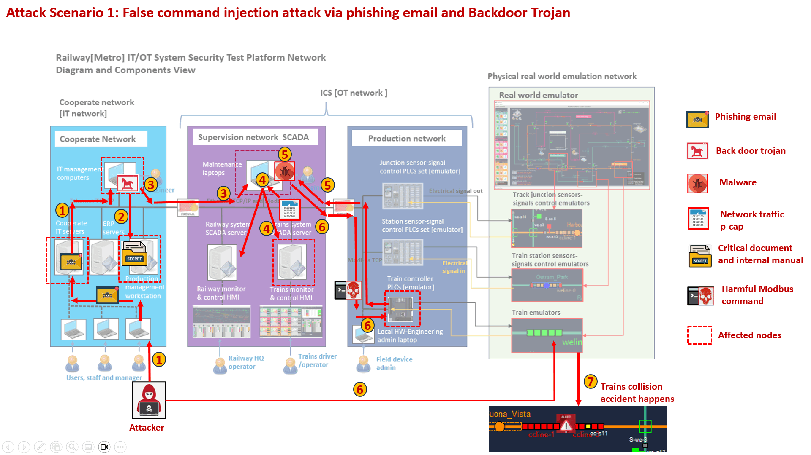

# Cyber-Attack Scenario

**Project Design :** To full filled some demo and education purpose of the Railway[Metro] IT/OT System Security Test Platform, we will preset some cyber attack Scenario with the attack scripts to demo applying different attack on the platform. Currently below attack scenario are included: 

- False command injection attack via phishing email and Backdoor Trojan

[TOC]

------

### Attack Scenario 1: False command injection attack via phishing email and backdoor trojan

#### Introduction 

In this attack scenario, we will show how a hacker makes a breakthrough of a internal laptop in the cooperate network via phishing email, collects the critical documents from management workstation, gains the remote control of a security-careless configured maintenance laptop in the SCADA network then launch the harmful/false commands to attack the trains controller PLCs to cause the train collision accident in the real-world. The attack road map is shown below:

#### Detailed Attack Storyline

As shown the introduction and the attack road map, the hacker will do the attack via below 7 steps: 

##### Attack Step1

**Insert backdoor trojan to a node in IT-network via phishing email** 

The attacker uses one normal user/staff (Alice)'s laptop to send a phishing email (contents a fake IT support application form with a file download link)  to the IT management team.

##### Attack Step2

**Scan the IT-network to find the information to hack into the SCADA network**

A remiss IT-service-support engineer Bob opened the phishing email, clicked the link and downloaded the backdoor trojan program. When the trojan is active, it changes Bob's laptop's remote login configuration, so the attacker is able to remotely check Bob's browser history,  cookies, commands history. After analyzed Bob's history and log, the attacking is able to access some company's credentials document and internal system operating manuals in the production management workstation. 

After attacker analyzed all the accessible documents in the workstation and Bob's history log, he figured out below hints can be used for attacking:

- There is a computer in supervision network behind the firewall and Bob did use his IT-Support laptop to SSH login it before, the attacker can use this to pass though the firewall.
- There are 2 SCADA servers in the supervision network.
- The maintenance laptop's login credential may be in one of the password record files in the management workstation.
- Every PLC has a communication node IP whitelist, only the node in 'allow_read_whitelist' is allowed to fetch data from PLC and only the node in 'allow_write_whitelist' is allowed to change the PLC state, the maintenance laptop may be in the two lists.

##### Attack Step3

**Find the break point and hack into a maintenance laptop in SCADA network **

After tried every username/password in the record file, the attacker ssh login the maintenance laptop (in the SCADA network) successfully. He scanned the network to try to figure out the supervision network structure and the server's IP addresses, then he roughly understands the network topology of the SCADA network and found 2 servers may be the SCADA servers introduced in one of the user manuals he found in step2.

##### Attack Step4

**Scan the SCADA network and analyze the traffic** 

The attack tried to capture the p-cap of the 2 servers which he thought are SCADA servers, he finds the Modbus communication traffic packages. Based on the incoming Modbus message package length he figures out the trains' controller SCADA server (server A) IP address. Based on the outgoing Modbus package, he figured out the train's controller PLCs' IP address and some registers information (address and idx offset).

##### Attack Step5

**Create command control dictionary based network traffic analysis and real-world observation** 

The attacker created his own Modbus communication client (malware) program on the maintenance laptop, then he tries to connect to the PLC to run some PLC probing command to check whether this maintenance laptop is in the PLC's allow_read_whitelist. After he got successful fetching some data. Based on the fetched PLC data and the observation of the real-world emulator's trains state, the attacker created his mapping file of:

- PLC holding registers -> PLC electrical signal in -> Real-world trains' speed sensors.

So the attacker knows how to monitor the trains' state, then he try to run some coils' state change command to check this maintenance laptop is in the PLC's allow_write_whitelist. Based on the previous tranis sate monitor map and the coils command he sent, the attacker roughly understand the control sequence of the trains and created his mapping file of:

- PLC coils -> PLC electrical signal out -> Real-world trains' power control.

##### Attack Step6

**Insert false command to overwrite trains auto-collision avoidance control **

Based on the internal critical operator manuals the attacker found in step2, he also knows there is one PLC coil to enable/disable to trains' collision auto-avoidance setting. He analyzed the Modbus traffic, his trains PLC controller map and used his malware to insert the harmful PLC coils turn off command to overwrite the coils which he though may be used to disable the train collision auto-avoidance.

##### Attack Step7

**Plan the attack and insert train emergency command to make the train collision accident**

The attacker observed the real-world emulator, choose the train he wants to attack. Then he used his malware to insert train power off command to overwrite the PLC coils to active the targeted train's emergency stop. As the collision auto-avoidance is disabled in step 6, when the train behind the attacked trains arrived the attacked train location, the train accident happens.

------

> last edit by LiuYuancheng (liu_yuan_cheng@hotmail.com) by 07/08/2023 if you have any problem, please send me a message. 

