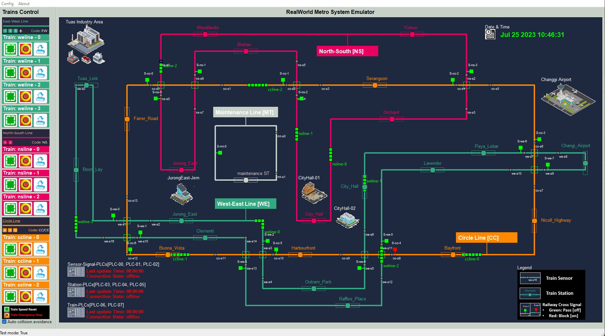
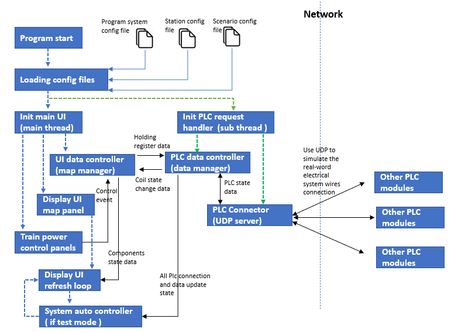
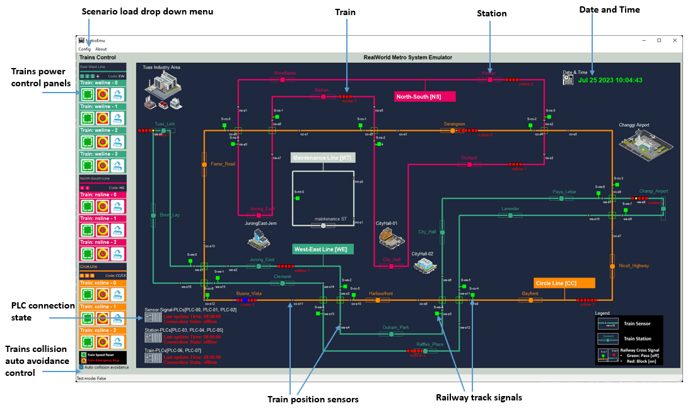
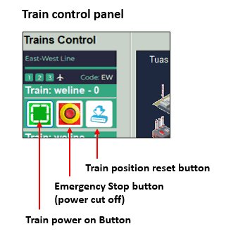
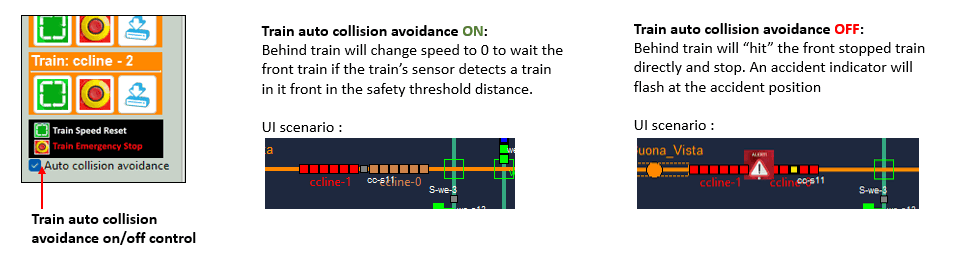
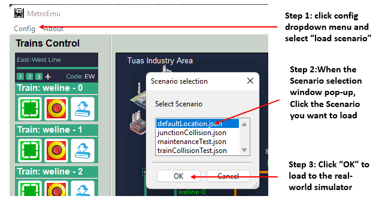

# 2D Railway[Metro] System Real-world Emulator

**Project Design :** we want to create a Railway system emulator to simulate the real world situation trains running on the railway such controlled by signal system, dock in the station and controlled by trains drivers. The system contents 4 tracks, 10 trains , the track junction signal control system, station control system and the train driver controller. It also provides PLC interface to connect to 3 set of PLC modules.

[TOC]

------

### Introduction 

The 2D Railway[Metro] System Real-world Emulator is part of the Railway IT/OT System security test platform. It is a OT system visualizer to simulate different kind of railway operation scenarios.  You can refer the system topology diagram to check its function in the system by below link:

-  [Railway IT/OT System security test platform system structure diagram](img/networkCommDesign.png)
- [Railway IT/OT System security test platform network topology diagram](img/networkDesign.png)

**2D Railway System Real-world Emulator User Interface:**



The emulator contents below components and function:

- Four railway tracks with 12 cross junction : west-east line (weline), north-south line (nsline), city circle line (ccline) and maintenance line (mtline).
- Ten trains with auto collision avoidance running on different track:  4 on weline, 3 on nsline and 3 on ccline.
- Sensor-Signal system: 39 sensors will detect the 10 trains position and control 17 signals at the track cross junction, if sensor detects a train has entered in a junction area, the signal will block other trains enter the junction. 
- Sensor-Station system: 22 sensors inside the 22 train stations will detect the 10 trains' docking sate, then control the station's train leaving signal to block the train to make it docking in the station and active the station's train entrance signal to block other trains entering the station. 
- Trains power control panel to on off train's power and reset the train's position. 
- PLC interface to all the PLC program to real all the components state and control the train, sensor-signal and the station system.
- Scenario loading function: All the user to load different pre-saved real-word scenario situation in the system such as trains collision on junction or station. 

**Program version:** `v0.1.2`

Code base: https://github.com/LiuYuancheng/Metro_emulator/tree/main/src/metroEmuUI


------

### Program Design

The program contents 2 main thread : 

- Main user interface thread: show the user interface and control all the components operation on the UI. 
- Data processing thread: handling the PLC electrical signal fetch and set, convert to PLC data to the UI components state data and update the data to UI thread.

This is the program modules workflow diagram: 

(The module "Other PLC modules" are not included)




##### User interface design

The program user interface design detail is shown below:




##### Program module files list

| Idx  | Program File                     | Execution Env | Description                                                  |
| ---- | -------------------------------- | ------------- | ------------------------------------------------------------ |
| 1    | configFiles/metroConfig.txt      |               | system config file.                                          |
| 2    | configFiles/*lineStation.json    |               | All the stations information config file                     |
| 3    | configFiles/TrainLocation/*.json |               | All the preset scenario config file.                         |
| 4    | img/*.png, *.jpg, *.icon         |               | All the UI picture materials file.                           |
| 5    | MetroEmuRun.py                   | python 3      | Main UI application program.                                 |
| 6    | metroEmuGobal.py                 | python 3      | System global file, the system config file's contents will be saved in the global parameters. |
| 7    | railwayAgent.py                  | python 3      | Components agents module to initialize all the different items shown on the map. |
| 8    | railwayMgr.py                    | python 3      | UI data controller, System auto controller                   |
| 9    | railwayPanel.py                  | python 3      | All the control panels                                       |
| 10   | railwayPanelMap.py               | python 3      | Real-world display panel                                     |
| 11   | dataMgr.py                       | python 3      | PLC data controller                                          |
|      |                                  |               |                                                              |

Libraries  required code base: https://github.com/LiuYuancheng/Metro_emulator/tree/main/src/lib 


------

### Program Setup

###### Development Environment : python 3.7.4

###### Additional Lib/Software Need

1. **wxPython** : https://docs.wxpython.org/index.html

   ```
   Install: pip install wxPython
   ```


###### Hardware Needed : None

###### Execution environment 

```
OS : Microsoft windows 10/11 home
Display mode:
- Display output: Yes
- Display resolution: 1920 x 1080
- Display orientation: Landscape
Network interface requirement:
- NIC number: 1
- RDP: enable
- NIC 1: IP address: 10.0.10.100, gateway: 10.0.10.1
```


------

### Program Usage


##### Edit Configuration File 

Open config file `metroConfig.txt`,  if you want to run this program individually, set the test mode flag `TEST_MD` to True. If you want to connect to other modules such as the PLCs, please set the flag to False.


##### Program Execution 

After follow the instruction in the file `metroConfig.txt` to setup all the parameters, you can run the program: 

```
python MetroEmuRun.py
```

or double click the file `runMetroEmuUI_win.bat`


##### Interface Usage

Please to refer to the [2D Railway[Metro] System Real-world Emulator User Manual]() to check the detail usage for all the functions. Below are some of the usage functions: 

**Function 1**: Change Train power or reset train position: 

 

**Function 2:**  ON/OFF the train collision auto-avoidance : 



**Function 3 :** Load Pre-saved scenario in the system




------

#### Problem and Solution

Refer to `doc/ProblemAndSolution.md`


------

> last edit by LiuYuancheng (liu_yuan_cheng@hotmail.com) by 25/07/2023 if you have any problem, please send me a message. 