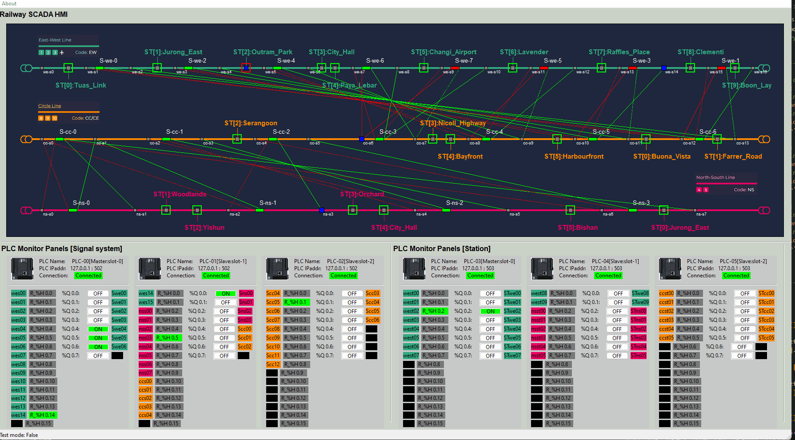
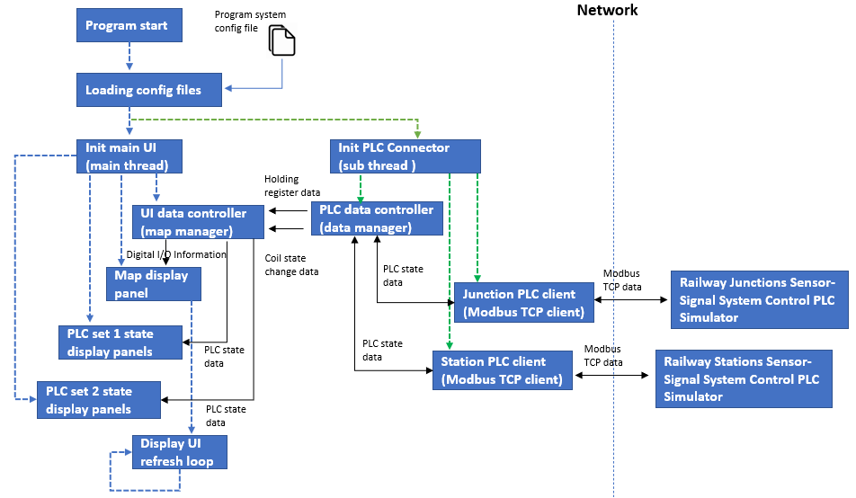
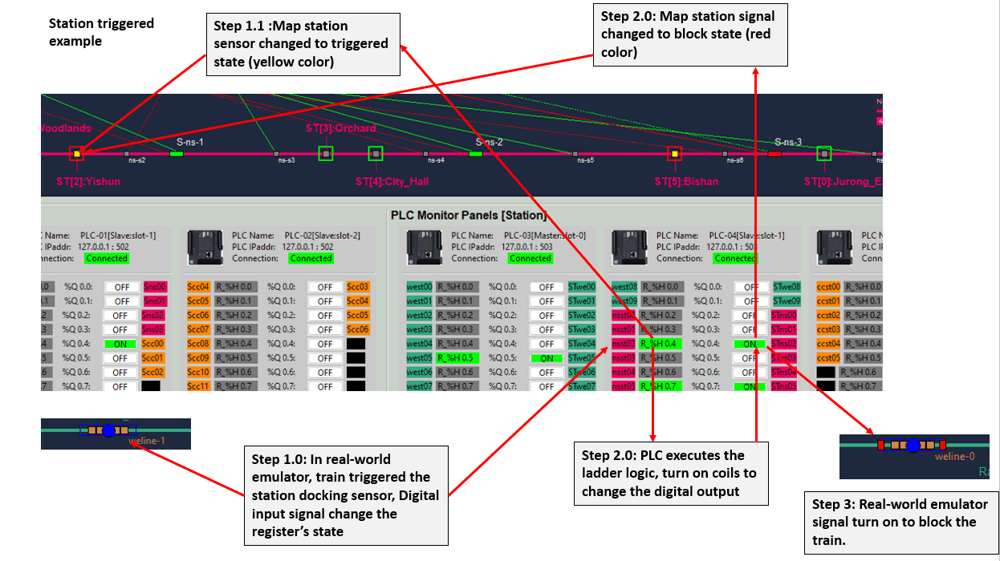
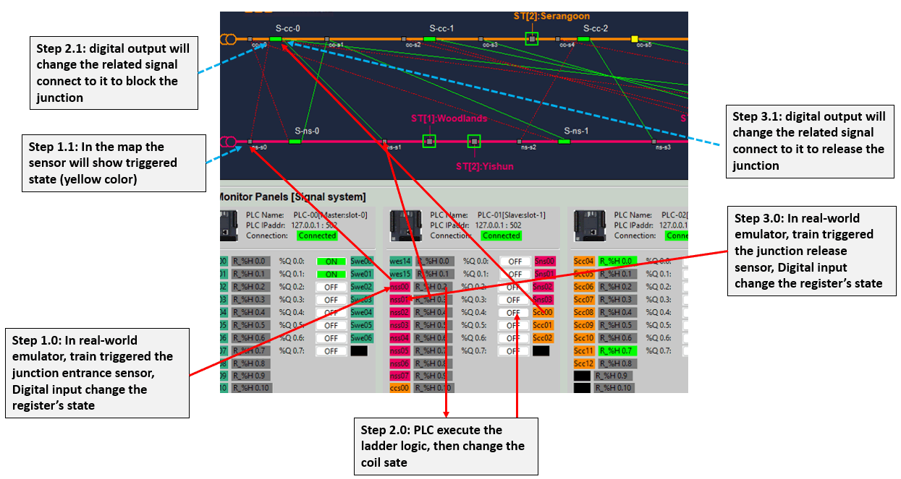

# Railway System SCADA HMI

**Project Design :** We want to create a railway SCADA (Supervisory Control and Data Acquisition) program with a HMI (Human Machine Interface ) to provide below multiple railway junctions and stations state monitor and control functions:

- Provide PLC (Modbus TCP) connection interface to fetch/set the PLCs' register/coils state.
- Visualize the connected PLC's holding register state, coils state and the digital I/O state. 
- Visualize the tracks junction the sensor & signal state and sensor-signal auto-controlling process. 
- Visualize the tracks train-station sensor & signal state and sensor-signal auto-controlling process  . 
- Provide the sensors and signals' state overload control (admin engineer debug permission).

[TOC]

------

### Introduction 

The Railway System SCADA HMI is part of the Railway IT/OT System security test platform. It is used to monitor the whole railway tracks sensors-signal auto control system.  You can refer the system topology diagram to check its function in the system by below link:

-  [Railway IT/OT System security test platform system structure diagram](img/networkCommDesign.png)
-  [Railway IT/OT System security test platform network topology diagram](img/networkDesign.png)


**Railway System SCADA HMI User Interface**



The HMI contents below components and function:

- A train sensors-signal relation map to show sensors state, signals state and the sensors-signals auto control relation ship (tracks-cross-junction and train-stations). 
- Three PLC panel to show the junction-sensor-signal control system's Digital Input/Output state, PLC holding register state and the PLC Coils state. 
- Three PLC panel to shoe the station-sensor-signal control system's Digital Input/Output state, PLC holding register state and the PLC Coils state. 

**Program version:** `v0.1.2`

Code Base: https://github.com/LiuYuancheng/Metro_emulator/tree/main/src/scadaEmuUI


------

### Program design

The program contents 2 main threads: 

- Main user interface thread : HMI map to show the junctions and stations' sensor-signal state, junction control PLC set [PLC-00, PLC-01 and PLC-02] state with the digital I/O information, station control PLC set [PLC-03, PLC-04 and PLC-05] state with the digital I/O information.
- PLC Communication thread : communicate with the Railway Junctions Sensor-Signal System Control PLC Simulator and Railway Stations Sensor-Signal System Control PLC Simulator through Modbus TCP to get the OT data.

This is the program modules workflow diagram: 




##### User interface design

The program user interface design detail is shown below:


##### Program module files list

| Idx  | Program File       | Execution Env | Description                                                  |
| ---- | ------------------ | ------------- | ------------------------------------------------------------ |
| 1    | scadaHMIConfig.txt |               | system config file.                                          |
| 2    | scadaGobal.py      | python 3      | System global file, the system config file's contents will be saved in the global parameters. |
| 3    | hmiPanel.py        | python 3      | All the UI function panels (PLC) module.                     |
| 4    | scadaDataMgr.py    | python 3      | This module provides map manger to generate the display panel ,  data manger to process the PLC data, PLC connector to communicate with PLC. |
| 5    | hmiPanelMap.py     | python 3      | The main display panel                                       |
| 6    | hmiMgr.py          | python 3      | Display information manager module.                          |
| 7    | hmiEmuRun.py       | python 3      | Main HMI user interface.                                     |
|      |                    |               |                                                              |

Libraries  required code base: https://github.com/LiuYuancheng/Metro_emulator/tree/main/src/lib


------

###### Development Environment : python 3.7.4

###### Additional Lib/Software Need

1. **wxPython** : https://docs.wxpython.org/index.html

   ```
   Install: pip install wxPython
   ```


###### Hardware Needed : None

###### Execution environment 

```
OS : Microsoft windows 10/11 home
Display mode:
- Display output: Yes
- Display resolution: 1920 x 1080
- Display orientation: Landscape
Network interface requirement:
- NIC number: 1
- RDP: enable
- NIC 1: IP address: 10.0.10.100, gateway: 10.0.10.1
```


------

### Program Usage

##### Edit Configuration File 

Open config file `scadaHMIConfig.txt`,  if you want to run this program individually, set the test mode flag `TEST_MD` to True. If you want to connect to other modules such as the PLCs, please set the flag to False.


##### Program Execution 

After follow the instruction in the file `trainHMIConfig.txt` to setup all the parameters, you can run the program: 

```
python hmiEmuRun.py
```

or double click the file `runTrainsCtrlHMI.bat`


##### Interface Usage

Please to refer to the [Railway System SCADA HMI User Manual]() to check the detail usage for all the functions. Below are some of the usage functions: 

##### Train docking situation 

The station docking senor will be triggered and station signal will change to block state with below steps when a train is trying to dock in station:



##### Junction clock and release situation 




------

#### Problem and Solution

Refer to `doc/ProblemAndSolution.md`


------

> last edit by LiuYuancheng (liu_yuan_cheng@hotmail.com) by 28/07/2023 if you have any problem, please send me a message. 

