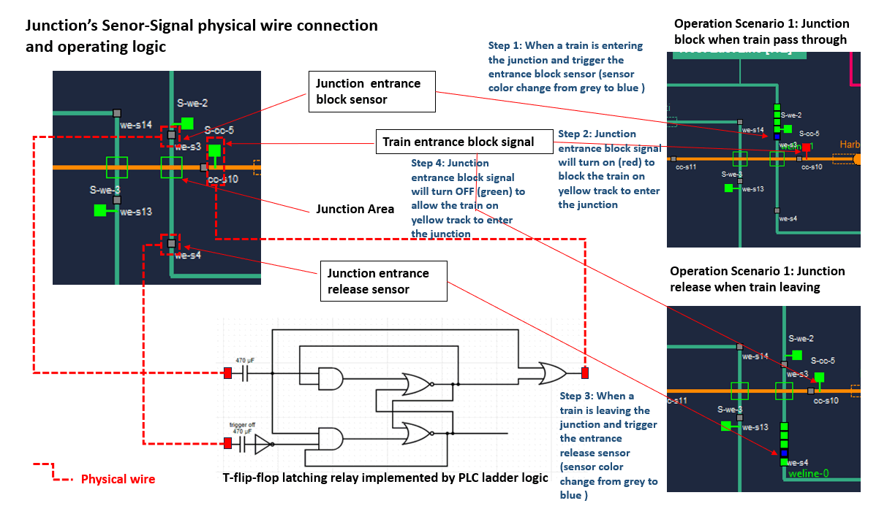

# Railway Sensor-Signal System Control PLC Simulator

**Project Design :** we want to create a Programmable Logic Controllers(PLC) set with 3 PLCs to below tasks:

1. Read the 39 train sensors (connect to PLCs' input) state from the real-word emulator to PLCs' holding register state.
2.  Run the pre-set ladder logic (flip-flop latching relay) to change the 19 real-world signals (connect to PLCs' output coils) state. 
3. Create a ModBus server to handle the HMI's ModBus TCP request to update/change register/coils value. 

This simulator will simulate 3 standard Siemens S71200 PLCs (16 input + 8 output / total 48 input + 24 output) PLCs connected under master and salve mode with rs422 multi-drop cable as below:

So the HMI can control 3 PLCs' state by connecting master PLC's ip address through ModBus TCP protocol. 

[TOC]

------

### Introduction 

Railway Sensor-Signal System Control PLC Simulator is part of the Railway IT/OT System security test platform. It is used to control the sensors-signals system of the railway junctions. You can refer the system topology diagram to check its function in the system by below link:

-  [Railway IT/OT System security test platform system structure diagram](img/networkCommDesign.png)
-  [Railway IT/OT System security test platform network topology diagram](img/networkDesign.png)

Three PLC (PLC-00, PLC-01, PLC02) are involved in this program, PLC-00 is the master and PLC-01, PLC-02 are the salve. This program is used to control the railway's junction sensor signal system. There will be 39 input and 19 output and 17 ladder logic in this PLC set. 

Each railway's junction is controlled  by 2 or 3  ladder logic and each ladder logic will read 2 sensor's state and control 1 or 2 signal state. Below diagram shows the wire connection and steps of how one of the 17 ladder logic controlling part of the junction. (When a train on green track entering a junction, turn on signal block the trains on yellow line, when a train has left the junction, turn off the signal to release entrance of the junction for yellow line)

**Program version:** `v0.1.2`

Code base: https://github.com/LiuYuancheng/Metro_emulator/tree/main/src/plcCtrl/signalPlcEmu

------

### Program Design

The program contents 3 main thread : 

- Real-world communication thread to fetch junction sensors data and set signals state. 
- Ladder logic execution state, once there is holding registers' state change, executed the related binding logic to change the coils state. 
- Modbus server thread to handling the Modbus TCP request from HMI.

This is the program modules workflow diagram: 

(The module "2D Railway[Metro] System Real-world Emulator" and "Railway[Metro] System SCADA-HMI" are not included)

##### System ladder logic 

The system contents 19 ladder logic which shown in the introduction. The PLC input => Holding register => ladder logic => Coil => PLC output map is shown below: 

You can also check the excel file `ladderConnectionMap.xlsx` to see the mapping detail. 

