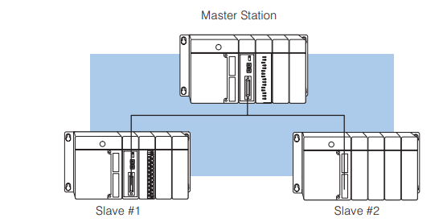
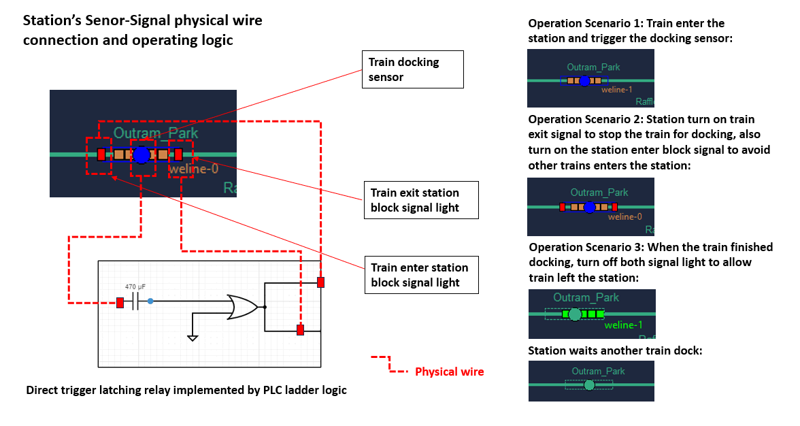
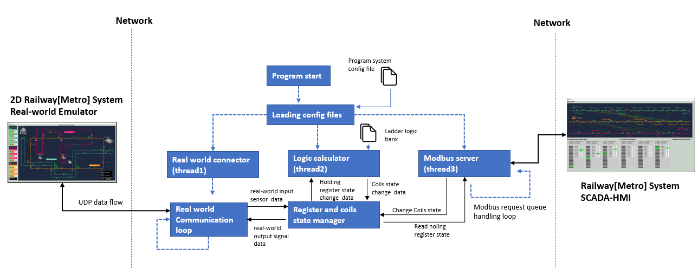
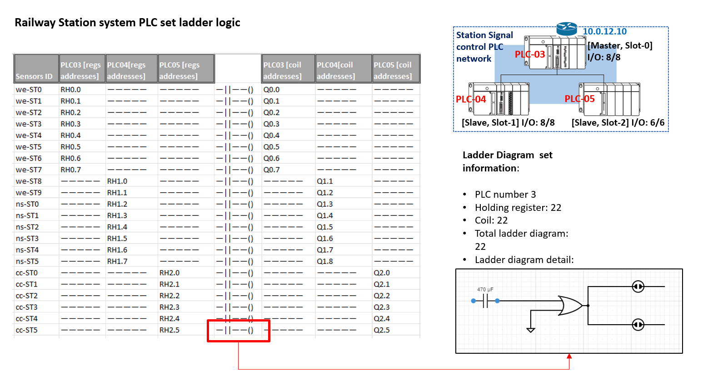

# Railway Stations Sensor-Signal System Control PLC Simulator

**Project Design :** we want to create a Programmable Logic Controllers(PLC) set with 3 PLCs to below tasks:

1. Read the 22 train stations' train dock sensors  (connect to PLCs' input) from the real-word emulator to PLCs' holding register state.
2. Run the pre-set ladder logic (direct trigger latching relay) to change the 44 real-world station enter/exit signals (connect to PLCs' output coils) state. 
3. Create a Modbus server to handle the HMI's Modbus TCP request to update/change register/coils value. 

This simulator will simulate 3 standard Siemens S71200 PLCs (16 input + 8 output / total 48 input + 24 output) PLCs connected under master and salve mode with rs422 multi-drop cable as below:



So the HMI can control 3 PLCs' state by connecting master PLC's ip address through Modbus TCP protocol. 

[TOC]

------

### Introduction 

Railway Station Sensor-Signal System Control PLC Simulator is part of the Railway IT/OT System security test platform. It is used to control the trains' docking process in the railway system. You can refer the system topology diagram to check its function in the system by below link:

-  [Railway IT/OT System security test platform system structure diagram](img/networkCommDesign.png)
-  [Railway IT/OT System security test platform network topology diagram](img/networkDesign.png)

Three PLC (PLC-03, PLC-04, PLC05) are involved in this program, PLC-03 is the master and PLC-04, PLC-05 are the salve. This program is used to control the railway's station system. There will be 22 input and 22 output and 22 ladder logic in this PLC set. 

Each station is controlled by one train docking sensor and 2 train block signals(enter/exit), Below diagram shows the wire connection and steps of how one of the 22 ladder logic controls a station. 

- When a docking sensor is trigger, station will raise exit block signal to total stop the train, then raise enter block signal to avoid other train enter. 
- When the docking train finishes, station will turn off the exit block signal to release the train, the turn off the enter block signal to allow other trains dock. 



**Program version:** `v0.1.2`

Code base: https://github.com/LiuYuancheng/Metro_emulator/tree/main/src/plcCtrl/stationPlcEmu


------

### Program Design 

The program contents 3 main thread : 

- Real-world communication thread to fetch junction sensors data and set signals state. 
- Ladder logic execution thread, once there is holding registers' state change, executed the related binding logic to change the coils state. 
- Modbus server thread to handling the Modbus TCP request from HMI.

This is the program modules workflow diagram: 



##### System ladder logic 

The system contents 19 ladder logic which shown in the introduction. The PLC input => Holding register => ladder logic => Coil => PLC output map is shown below: 



You can also check the excel file `ladderConnectionMap.xlsx` to see the mapping detail. 


##### Program module files list

| Idx  | Program File                         | Execution Env | Description                                                  |
| ---- | ------------------------------------ | ------------- | ------------------------------------------------------------ |
| 1    | stationPlcEmu/plcConfig.txt          |               | System config file.                                          |
| 2    | stationPlcEmu/plcSimGlobalStation.py | python 3      | System needs global file, the system config file's contents will be saved in the global parameters. |
| 3    | stationPlcEmu/plcSimulatorStation.py | python 3      | Main PLC simulation program.                                 |
|      |                                      |               |                                                              |

Libraries  required code base: https://github.com/LiuYuancheng/Metro_emulator/tree/main/src/lib 


------

### Program Setup

###### Development Environment : python 3.7.4

###### Additional Lib/Software Need

1. **pyModbusTCP** : https://github.com/sourceperl/pyModbusTCP

```
pip install pyModbusTCP
```

###### Hardware Needed : None

###### Execution environment 

```
OS : ubuntu 20.04 server
Display mode:
- Display output: No
VM Deploy Config: 
- NIC number: 2
- SSH: enable
- NIC 1: IP address: 10.0.10.12, gateway: 10.0.10.1
- NIC 2: IP address: 192.168.100.12, gateway: 192.168.100.1
```


------

### Program Usage

##### Edit Configuration File 

Open config file `plcConfig.txt`

```
# This is the config file template for the module <monitorApp.py>
# Setup the paramter with below format (every line follow <key>:<val> format, the
# key can not be changed):

# Set the master PLC's name 
PLC_NAME:PLC-03

# Define the ip addresses allowed to read PLC state: 
# json list fomat: ["masterIP", "slave1IP", ...]
ALLOW_R_L:["127.0.0.1", "192.168.0.10"]

# Define the ip addresses allowed to change PLC state: 
# json list fomat: ["masterIP", "slave1IP", ...]
ALLOW_W_L:["127.0.0.1"]

# Define Realworld emulator ip
RW_IP:127.0.0.1

# Define Realworld emulator connection port
RW_PORT:3001

# Define PLC clock interval
CLK_INT:0.9

# Define modbus TCP host IP, use 0.0.0.0 or localhost
MD_BUS_IP:localhost

# Define modbus TCP host Port, normally use 502
MD_BUS_PORT:503
```


##### Program Execution 

After follow the instruction in the file `metroConfig.txt` to setup all the parameters, you can run the program: 

```
python plcSimulatorStation.py
```

or double click the file `runStationPlcCtrlEmu_win.bat`


------

### Problem and Solution

Refer to `doc/ProblemAndSolution.md`


------

> last edit by LiuYuancheng (liu_yuan_cheng@hotmail.com) by 26/07/2023 if you have any problem, please send me a message. 

