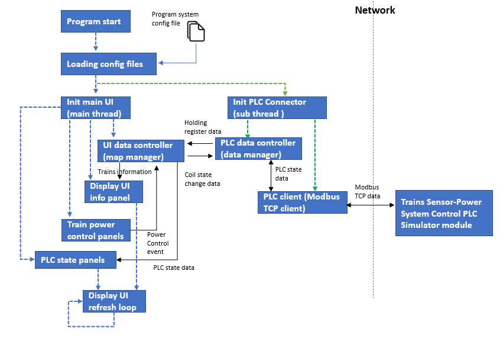
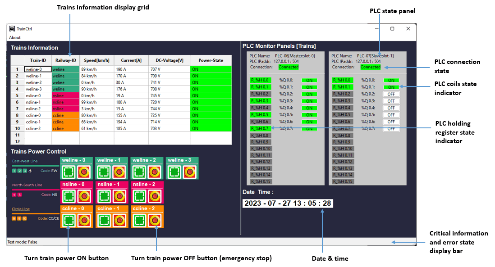
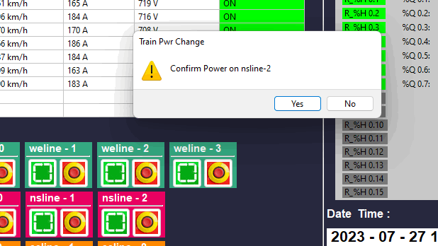
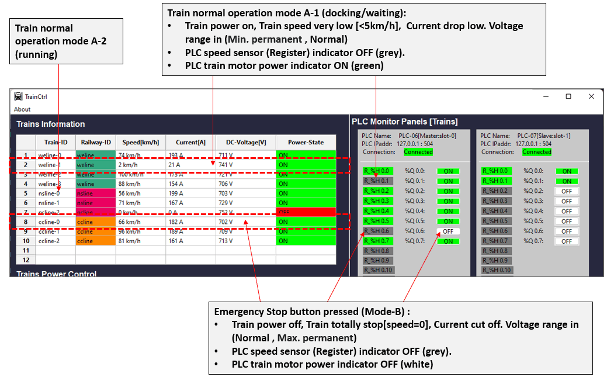

# Railway System Trains Controller HMI

**Project Design :**  We want to create a trains controller HMI ( Human Machine Interface ) to provide multiple trains information visualization and trains control with below function:

- Provide PLC (Modbus TCP) connection interface to fetch/set the PLC's register/coils state.
- Visualize the connected PLC's holding register and coils state.
- Read the data from trains control PLC sets, simulate a 750V-DC power trains system, display the related trains information (Speed, current, voltage) to user.
- Provide trains power control panel for user ON/OFF trains' power. 

[TOC]

------

### Introduction 

The Railway System Trains Controller HMI is part of the Railway IT/OT System security test platform. It is use to control the system's trains power and simulate the related feed back information of 750V-DC power trains system. You can refer the system topology diagram to check its function in the system by below link:

-  [Railway IT/OT System security test platform system structure diagram](img/networkCommDesign.png)
-  [Railway IT/OT System security test platform network topology diagram](img/networkDesign.png)

For the DC trains power system (600V-DC, 750V-DC, 1500V-DC, 3kV-DC) detail operating current, voltage information, please refer this wiki link: https://en.wikipedia.org/wiki/Railway_electrification

**Railway System Trains Controller HMI User Interface :**


The HMI contents below components and function:

- Trains information panel with a grid to show the trains related information: Train-ID, Speed, Current, Voltage and power state.
- Trains Power control button for use to turn on/off the trains' power.
- PLC state display panel to show the state of holding registers and output coils.
- Date & time display panel.

**Program version:** `v0.1.2`

Code Base: https://github.com/LiuYuancheng/Metro_emulator/tree/main/src/trainCtrlUI


------

### Program Design

The program contents 2 main thread : 

- Main user interface thread : show the train information, PLCs state and the control the train power. 
- PLC Communication thread : communicate with the Trains Sensor-Power System Control PLC Simulator module through Modbus TCP to get the OT data.

This is the program modules workflow diagram: 

(The "Trains Sensor-Power System Control PLC Simulator module" is not included )




##### User interface design

The program user interface design detail is shown below:



##### Program module files list

| Idx  | Program File       | Execution Env | Description                                                  |
| ---- | ------------------ | ------------- | ------------------------------------------------------------ |
| 1    | trainHMIConfig.txt |               | system config file.                                          |
| 2    | trainCtrlGlobal.py | python 3      | System global file, the system config file's contents will be saved in the global parameters. |
| 3    | trainCtrlPanel.py  | python 3      | All the UI function panels module.                           |
| 4    | trainDataMgr.py    | python 3      | This module provides map manger to generate the display panel ,  data manger to process the PLC data, PLC connector to communicate with PLC. |
| 5    | trainCtrlRun.py    | python        | Main HMI user interface.                                     |
|      |                    |               |                                                              |

Libraries  required code base: https://github.com/LiuYuancheng/Metro_emulator/tree/main/src/lib 


------

###### Development Environment : python 3.7.4

###### Additional Lib/Software Need

1. **wxPython** : https://docs.wxpython.org/index.html

   ```
   Install: pip install wxPython
   ```


###### Hardware Needed : None

###### Execution environment 

```
OS : Microsoft windows 10/11 home
Display mode:
- Display output: Yes
- Display resolution: 1920 x 1080
- Display orientation: Landscape
Network interface requirement:
- NIC number: 1
- RDP: enable
- NIC 1: IP address: 10.0.10.100, gateway: 10.0.10.1
```


------

### Program Usage

##### Edit Configuration File 

Open config file `trainHMIConfig.txt`,  if you want to run this program individually, set the test mode flag `TEST_MD` to True. If you want to connect to other modules such as the PLCs, please set the flag to False.


##### Program Execution 

After follow the instruction in the file `trainHMIConfig.txt` to setup all the parameters, you can run the program: 

```
python trainCtrlRun.py
```

or double click the file `runTrainsCtrlHMI.bat`


##### Interface Usage

Please to refer to the [Railway System Trains Controller HMI User Manual]() to check the detail usage for all the functions. Below are some of the usage functions: 

**Function 1**: Change a train's power

Press the "Green power on" button to turn on the power or "Red emergency stop" button to turn off the train power when the HMI connected to the PLC. When power is changed, a confirm message dialog will pop-up as shown below:





##### Train Operation Modes

A train may have 3 kinds of operating mode as as shown below: 

 

| Mode                 | Train power | Motor state      | Speed    | current | DC-voltage   |
| -------------------- | ----------- | ---------------- | -------- | ------- | ------------ |
| A1 [running]         | on          | throttle neutral | very low | low     | about 750V   |
| A2 [docking/waiting] | on          | throttle engage  | normal   | normal  | (600V-750V ) |
| B1[Stop]             | on          | throttle neutral | 0        | 0       | (750V-00V)   |


------

#### Problem and Solution

Refer to `doc/ProblemAndSolution.md`


------

> last edit by LiuYuancheng (liu_yuan_cheng@hotmail.com) by 27/07/2023 if you have any problem, please send me a message. 